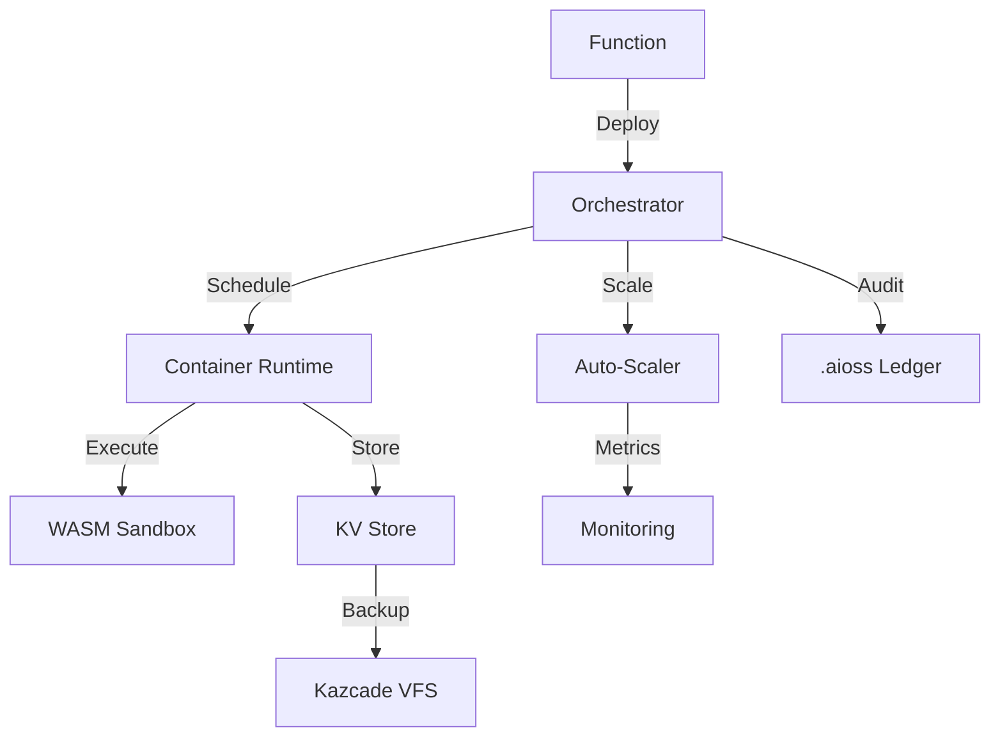
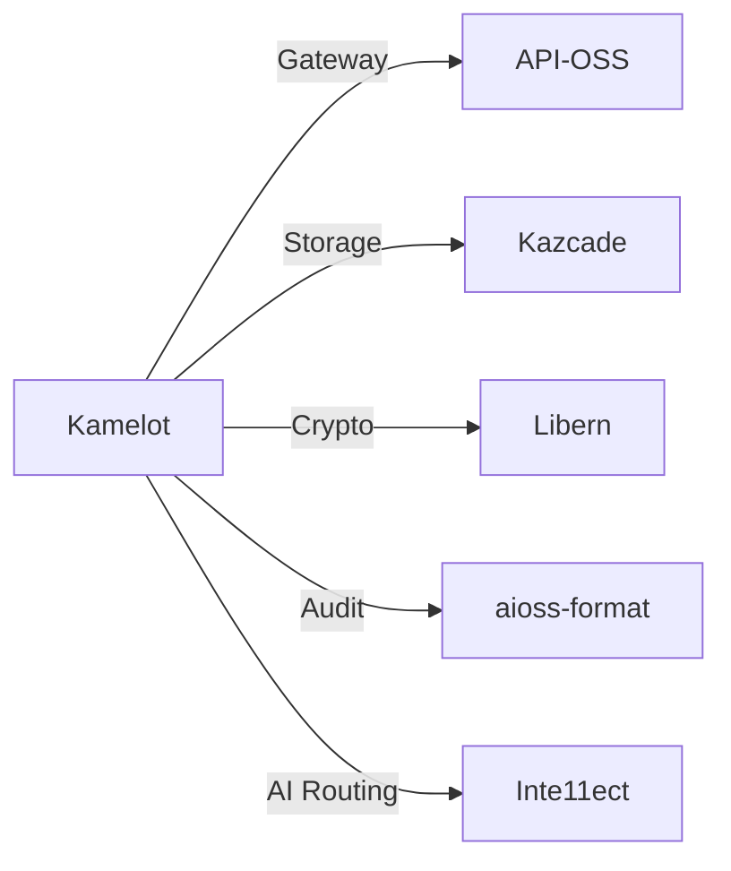
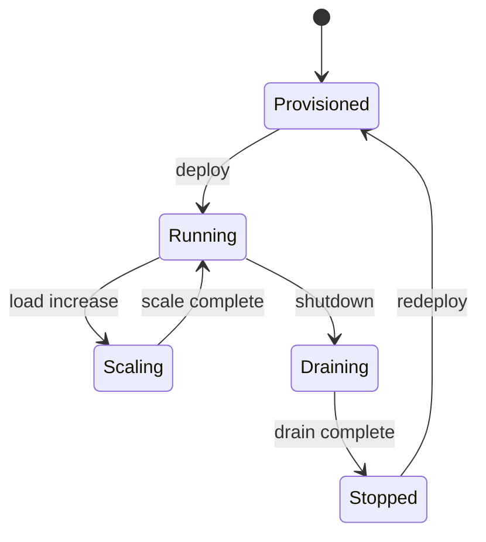

<!-- SEO -->
<meta name="description" content="Kamelot — cloud runtime & AI orchestration with semantic vector file system, 1536-dim embedding search (91% recall), BLAKE3 hash-chain integrity.">
<meta name="keywords" content="kamelot, cloud runtime, AI orchestration, serverless, container orchestration, multi-cloud">


<!-- Breadcrumb: Home > Projects > Kamelot -->


# Kamelot

Cloud Runtime & AI Orchestration with serverless containers and multi-cloud deployment.

## Quick Facts

| Attribute | Value |
|-----------|-------|
| **Status** |  |
| **Category** | Cloud & AI |
| **Language** | Rust |
| **Source** | [`02-kamelot/`](https://github.com/kleinnner/Anticloud/tree/main/02-kamelot) |
| **Dependencies** | API-OSS, Libern, Kazcade |

## Architecture Flow



## Relationship Graph



## Deployment Lifecycle



## Key Features

- **Serverless Runtime**: Function-as-a-Service with WASM isolation
- **AI Orchestration**: Model deployment and inference routing
- **Multi-Cloud**: Deploy across AWS, GCP, Azure, or on-prem
- **Auto-Scaling**: Event-driven scaling with custom metrics
- **Container Runtime**: Lightweight OCI-compatible runtime
- **Audit Logging**: All operations signed to .aioss ledger

## Related Projects

| Project | Relationship | Protocol |
|---------|-------------|----------|
| [API-OSS](API-OSS) | API gateway — REST interface for service orchestration | REST |
| [Libern](Libern) | Cryptographic dependency — provides Ed25519, SHA3-256 | FFI |
| [Kazcade](Kazcade) | Storage backend — CRDT-synced vector state | P2P/CRDT |

---

> 📖 **Full docs**: [Docusaurus Kamelot](https://kleinnner.github.io/Anticloud/docs/projects/kamelot) · [Home](Home) · [Projects](Projects) · [Architecture](Architecture) · [Ecosystem](Ecosystem) · [Roadmap](Roadmap) · [Glossary](Glossary) · [Protocol-Spec](Protocol-Spec)

```
.====================================================================.
!  Made in the UAE, Dubai #DubaiIt #Dubai #Dxb #SovereignAI          !
!  Made in The Emirates #Dubai_it                                    !
!                                                                    !
!  Lois-Kleinner Alpasan - The Anticloud 2026-                       !
!                                                                    !
!  As seen on:                                                       !
!  Harvard Dataverse ! Zenodo/CERN ! OSF ! DANS ! Figshare           !
!  Academia.edu ! HuggingFace ! ORCID                                !
!  Internet Archive ! anticloud.telepedia.net ! Miraheze             !
!  anticloud.fandom.com                                             !
!                                                                    !
!  0-1.gg ! GitHub ! GitLab ! Codeberg ! GH Pages                    !
!  HuggingFace ! Blog ! Bluesky ! Mastodon                           !
!  LinkedIn ! DEV ! WordPress ! Tumblr                               !
!                                                                    !
!  Sovereign AI ! Local-First ! Privacy ! Zero Trust ! No Datacenter !
!  Air-Gapped ! Open Source ! Rust ! Hash Chain ! Single Binary      !
!  Offline LLM ! Crypto Ledger ! P2P ! Federated                     !
'===================================================================='
```

Lois-Kleinner Alpasan, 22, has served executive roles spanning technology, operations, finance, and product across 20+ organizations. His cross-functional work combines architecture, business, and AI strategy.

References:
1. Lois-Kleinner Zenodo: https://doi.org/10.5281/zenodo.20781790
2. Lois-Kleinner GitHub: https://github.com/kleinnner/Anticloud/tree/main/04-aioss-format
3. Lois-Kleinner Harvard DV: https://doi.org/10.7910/DVN/KFK12Y
4. Lois-Kleinner Internet Arc: https://archive.org/details/aioss-format
5. Lois-Kleinner ORCID: https://orcid.org/0009-0009-2233-6107
6. Lois-Kleinner DEV.to: https://dev.to/kleinner
7. Lois-Kleinner LinkedIn: https://linkedin.com/in/kleinner
8. Lois-Kleinner HuggingFace: https://huggingface.co/Anticloud
9. Lois-Kleinner Tumblr: https://anticloud.tumblr.com
10. Lois-Kleinner Mastodon: https://mastodon.social/@kleinner
11. Lois-Kleinner Bluesky: https://bsky.app/profile/kleinner.bsky.social
12. 0-1.gg: https://0-1.gg
13. Lois-Kleinner Figshare: https://figshare.com/authors/Lois-Kleinner_Alpasan/20849885
14. Lois-Kleinner Academia: https://independent.academia.edu/kleinner
15. Lois-Kleinner Telepedia: https://anticloud.telepedia.net/wiki/Anticloud_by_Lois-Kleinner_Wiki
16. Lois-Kleinner Fandom: https://anticloud.fandom.com
17. AIOSS Offline Verification Kit: https://dataverse.harvard.edu/dataset.xhtml?persistentId=doi:10.7910/DVN/OORKNJ