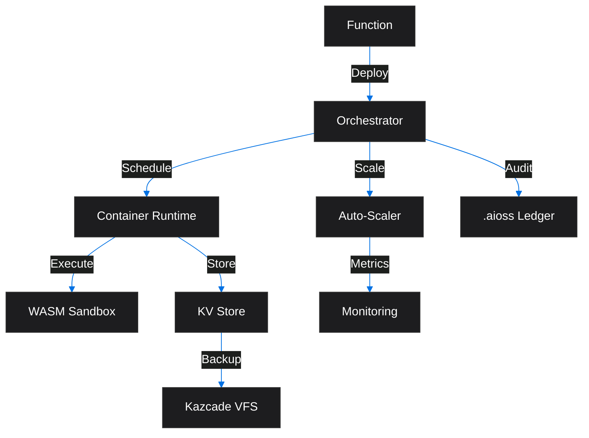
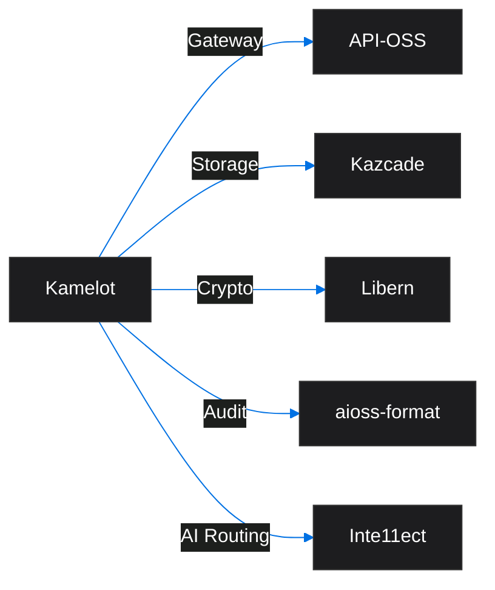
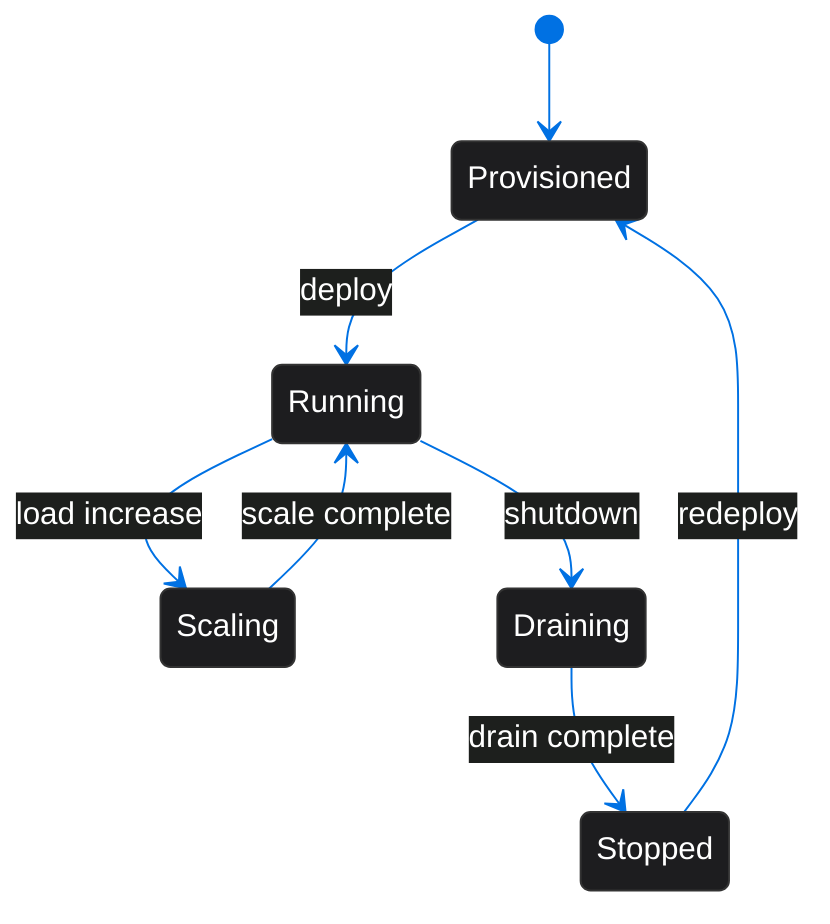

<!-- SEO -->
<meta name="description" content="Kamelot — cloud runtime & AI orchestration with semantic vector file system, 1536-dim embedding search (91% recall), BLAKE3 hash-chain integrity.">
<meta name="keywords" content="kamelot, cloud runtime, AI orchestration, serverless, container orchestration, multi-cloud">

<!-- Breadcrumb: Home > Projects > Kamelot -->

# Kamelot

Cloud Runtime & AI Orchestration with serverless containers and multi-cloud deployment.

## Quick Facts

| Attribute | Value |
|-----------|-------|
| **Status** |  |
| **Category** | Cloud & AI |
| **Language** | Rust |
| **Source** | [`02-kamelot/`](https://github.com/kleinnner/Anticloud/tree/main/02-kamelot) |
| **Dependencies** | API-OSS, Libern, Kazcade |

## Architecture Flow

## Relationship Graph

## Deployment Lifecycle

## Key Features

- **Serverless Runtime**: Function-as-a-Service with WASM isolation
- **AI Orchestration**: Model deployment and inference routing
- **Multi-Cloud**: Deploy across AWS, GCP, Azure, or on-prem
- **Auto-Scaling**: Event-driven scaling with custom metrics
- **Container Runtime**: Lightweight OCI-compatible runtime
- **Audit Logging**: All operations signed to .aioss ledger

## Related Projects

| Project | Relationship | Protocol |
|---------|-------------|----------|
| [API-OSS](API-OSS) | API gateway — REST interface for service orchestration | REST |
| [Libern](Libern) | Cryptographic dependency — provides Ed25519, SHA3-256 | FFI |
| [Kazcade](Kazcade) | Storage backend — CRDT-synced vector state | P2P/CRDT |

---

> 📖 **Full docs**: [Docusaurus Kamelot](https://kleinnner.github.io/Anticloud/docs/projects/kamelot) · [Home](Home) · [Projects](Projects) · [Architecture](Architecture) · [Ecosystem](Ecosystem) · [Roadmap](Roadmap) · [Glossary](Glossary) · [Protocol-Spec](Protocol-Spec)
