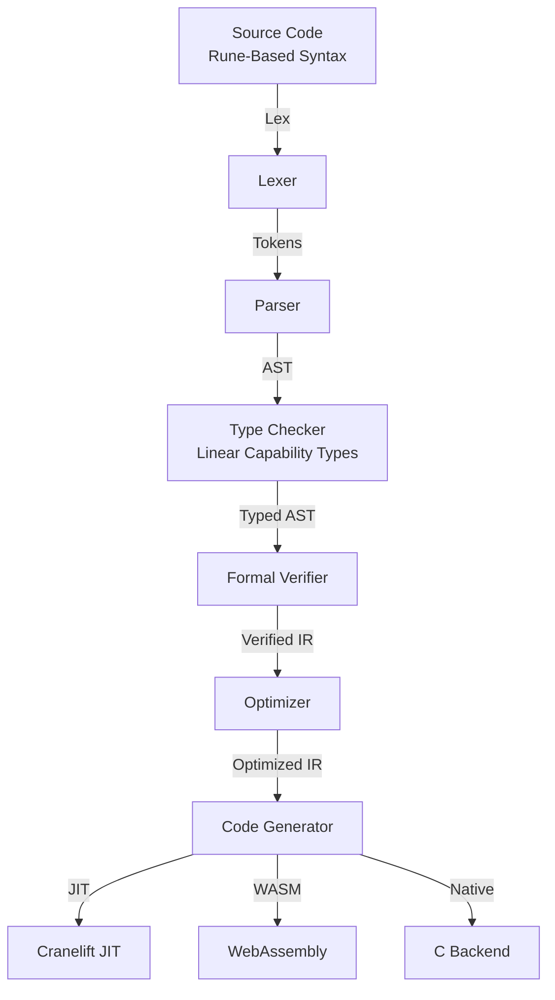
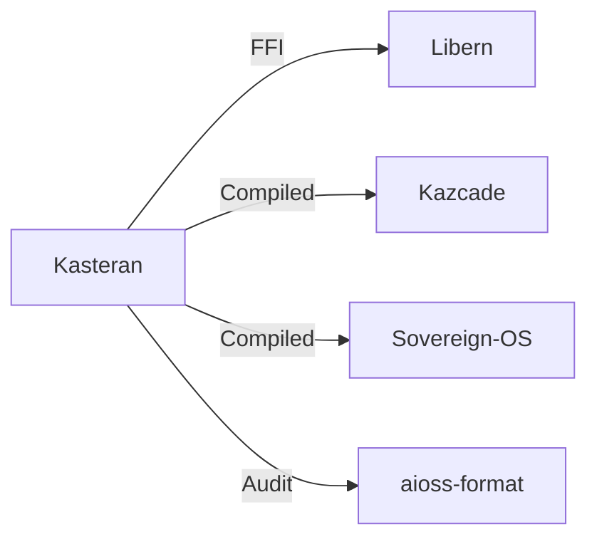
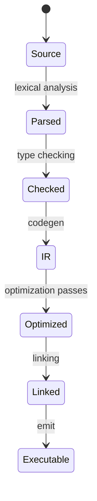

<!-- SEO -->
<meta name="description" content="Kasteran — rune-based systems language with linear capability types, self-hosted compiler with Cranelift JIT, WebAssembly, and C backends, formal verification.">
<meta name="keywords" content="kasteran, systems programming, rune-based language, symbolic syntax, memory safety, cryptography">

<!-- Breadcrumb: Home > Projects > Kasteran -->

# Kasteran

Rune-based Systems Language with linear capability types, self-hosted compiler with Cranelift JIT, WebAssembly, and C backends, formal verification pipeline.

## Quick Facts

| Attribute | Value |
|-----------|-------|
| **Status** |  |
| **Category** | Core Infrastructure |
| **Language** | Rust (self-hosted) |
| **Source** | [`03-kasteran/`](https://github.com/kleinnner/Anticloud/tree/main/03-kasteran) |
| **Dependencies** | Libern (crypto FFI) |

## Compiler Pipeline

## Relationship Graph

## Compilation Pipeline

## Key Features

- **Rune-Based Syntax**: Symbolic, expressive language design
- **Linear Capability Types**: Memory safety without GC
- **Self-Hosted Compiler**: Compiles itself since milestone M3
- **Three Backends**: Cranelift JIT, WebAssembly, C transpilation
- **Formal Verification**: Built-in theorem proving pipeline
- **Crypto Primitives**: Native FFI to Libern library

## Related Projects

| Project | Relationship | Protocol |
|---------|-------------|----------|
| [Libern](Libern) | Cryptographic dependency — provides Ed25519, SHA3-256 | FFI |
| [Kazcade](Kazcade) | Storage backend — CRDT-synced vector state | P2P/CRDT |
| [Sovereign-OS](Sovereign-OS) | Target platform — compiled binary deployment | Native |

---

> 📖 **Full docs**: [Docusaurus Kasteran](https://kleinnner.github.io/Anticloud/docs/projects/kasteran) · [Home](Home) · [Projects](Projects) · [Architecture](Architecture) · [Ecosystem](Ecosystem) · [Roadmap](Roadmap) · [Glossary](Glossary) · [Protocol-Spec](Protocol-Spec)
