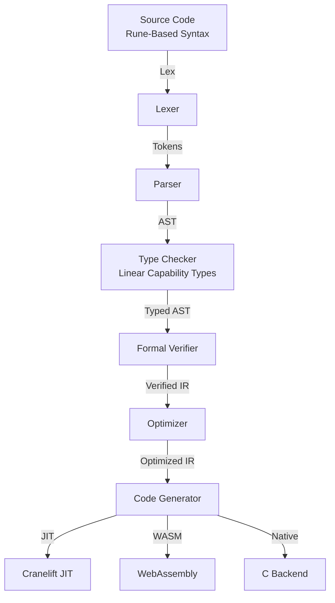
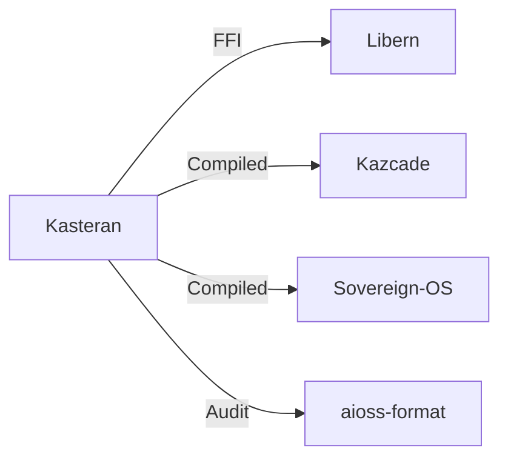
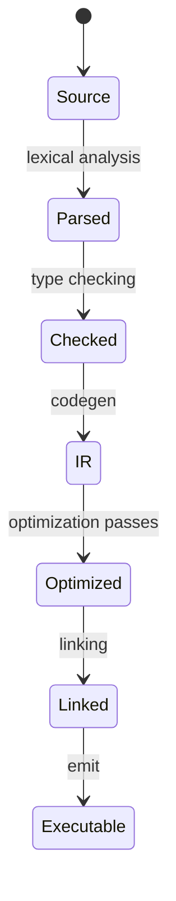

<!-- SEO -->
<meta name="description" content="Kasteran — rune-based systems language with linear capability types, self-hosted compiler with Cranelift JIT, WebAssembly, and C backends, formal verification.">
<meta name="keywords" content="kasteran, systems programming, rune-based language, symbolic syntax, memory safety, cryptography">


<!-- Breadcrumb: Home > Projects > Kasteran -->


# Kasteran

Rune-based Systems Language with linear capability types, self-hosted compiler with Cranelift JIT, WebAssembly, and C backends, formal verification pipeline.

## Quick Facts

| Attribute | Value |
|-----------|-------|
| **Status** |  |
| **Category** | Core Infrastructure |
| **Language** | Rust (self-hosted) |
| **Source** | [`03-kasteran/`](https://github.com/kleinnner/Anticloud/tree/main/03-kasteran) |
| **Dependencies** | Libern (crypto FFI) |

## Compiler Pipeline



## Relationship Graph



## Compilation Pipeline



## Key Features

- **Rune-Based Syntax**: Symbolic, expressive language design
- **Linear Capability Types**: Memory safety without GC
- **Self-Hosted Compiler**: Compiles itself since milestone M3
- **Three Backends**: Cranelift JIT, WebAssembly, C transpilation
- **Formal Verification**: Built-in theorem proving pipeline
- **Crypto Primitives**: Native FFI to Libern library

## Related Projects

| Project | Relationship | Protocol |
|---------|-------------|----------|
| [Libern](Libern) | Cryptographic dependency — provides Ed25519, SHA3-256 | FFI |
| [Kazcade](Kazcade) | Storage backend — CRDT-synced vector state | P2P/CRDT |
| [Sovereign-OS](Sovereign-OS) | Target platform — compiled binary deployment | Native |

---

> 📖 **Full docs**: [Docusaurus Kasteran](https://kleinnner.github.io/Anticloud/docs/projects/kasteran) · [Home](Home) · [Projects](Projects) · [Architecture](Architecture) · [Ecosystem](Ecosystem) · [Roadmap](Roadmap) · [Glossary](Glossary) · [Protocol-Spec](Protocol-Spec)

```
.====================================================================.
!  Made in the UAE, Dubai #DubaiIt #Dubai #Dxb #SovereignAI          !
!  Made in The Emirates #Dubai_it                                    !
!                                                                    !
!  Lois-Kleinner Alpasan - The Anticloud 2026-                       !
!                                                                    !
!  As seen on:                                                       !
!  Harvard Dataverse ! Zenodo/CERN ! Academia.edu ! HuggingFace      !
!  anticloud.telepedia.net ! anticloud.fandom.com                    !
!                                                                    !
!  0-1.gg ! GitHub ! LinkedIn ! DEV ! GH Pages                       !
!  HuggingFace ! Blog ! Bluesky ! Mastodon                           !
!  Internet Archive ! ORCID ! Figshare                               !
!                                                                    !
!  Sovereign AI ! Local-First ! Privacy ! Zero Trust ! No Datacenter !
!  Air-Gapped ! Open Source ! Rust ! Hash Chain ! Single Binary      !
!  Offline LLM ! Crypto Ledger ! P2P ! Federated                     !
'===================================================================='
```

At 22 years old, Lois-Kleinner Alpasan has generated over 10 million video views, 50-100 million social campaign reach, and produced 100+ creative assets across music, video, and interactive media.

References:
1. Lois-Kleinner Zenodo: https://doi.org/10.5281/zenodo.20776158
2. Lois-Kleinner GitHub: https://github.com/kleinnner/Anticloud/tree/main/03-kasteran
3. Lois-Kleinner Harvard DV: https://doi.org/10.7910/DVN/3VDF75
4. Lois-Kleinner Internet Arc: https://archive.org/details/kasteran
5. Lois-Kleinner ORCID: https://orcid.org/0009-0009-2233-6107
6. Lois-Kleinner DEV.to: https://dev.to/kleinner
7. Lois-Kleinner LinkedIn: https://linkedin.com/in/kleinner
8. Lois-Kleinner HuggingFace: https://huggingface.co/Anticloud
9. Lois-Kleinner Tumblr: https://anticloud.tumblr.com
10. Lois-Kleinner Mastodon: https://mastodon.social/@kleinner
11. Lois-Kleinner Bluesky: https://bsky.app/profile/kleinner.bsky.social
12. 0-1.gg: https://0-1.gg
13. Lois-Kleinner Figshare: https://figshare.com/authors/Lois-Kleinner_Alpasan/20849885
14. Lois-Kleinner Academia: https://independent.academia.edu/kleinner
15. Lois-Kleinner Telepedia: https://anticloud.telepedia.net
16. Lois-Kleinner Fandom: https://anticloud.fandom.com