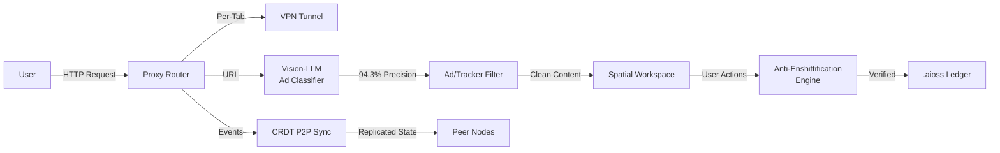
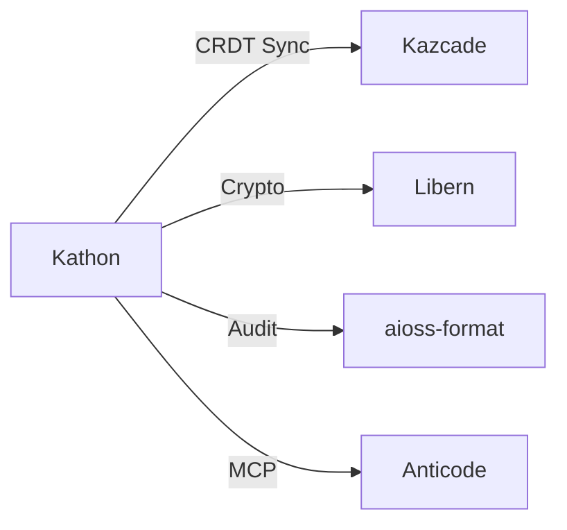

<!-- SEO -->
<meta name="description" content="Kathon — cryptographic browser with vision-LLM ad blocking (94.3% precision), CRDT P2P sync, spatial workspace, anti-enshittification engine, per-tab VPN.">
<meta name="keywords" content="kathon, cryptographic browser, vision LLM, ad blocking, CRDT, P2P sync, anti-enshittification">

# Kathon

Cryptographic Browser with vision-LLM ad blocking, CRDT P2P sync, spatial workspace, anti-enshittification engine, per-tab VPN.

## Quick Facts

| Attribute | Value |
|-----------|-------|
| **Status** |  |
| **Category** | Browser & Client |
| **Language** | Rust |
| **Source** | [`01-kathon/`](https://github.com/kleinnner/Anticloud/tree/main/01-kathon) |
| **Dependencies** | Libern (crypto), Kazcade (storage) |

## Architecture Flow

## Relationship Graph

## Key Features

- **Vision-LLM Ad Blocking**: 94.3% precision using ONNX models
- **Per-Tab VPN**: Isolated VPN tunnels per browser tab
- **CRDT P2P Sync**: Conflict-free replicated data types for distributed state
- **Spatial Workspace**: 2D canvas-based tab organization
- **Anti-Enshittification Engine**: Prevents platform degradation
- **Audit Trail**: All actions logged to .aioss ledger

---

> 📖 **Full docs**: [Docusaurus Kathon](https://kleinnner.github.io/Anticloud/docs/projects/kathon) · [Home](Home) · [Projects](Projects) · [Architecture](Architecture)
