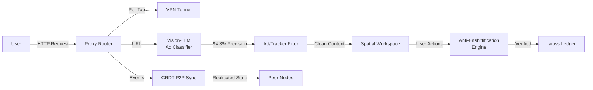
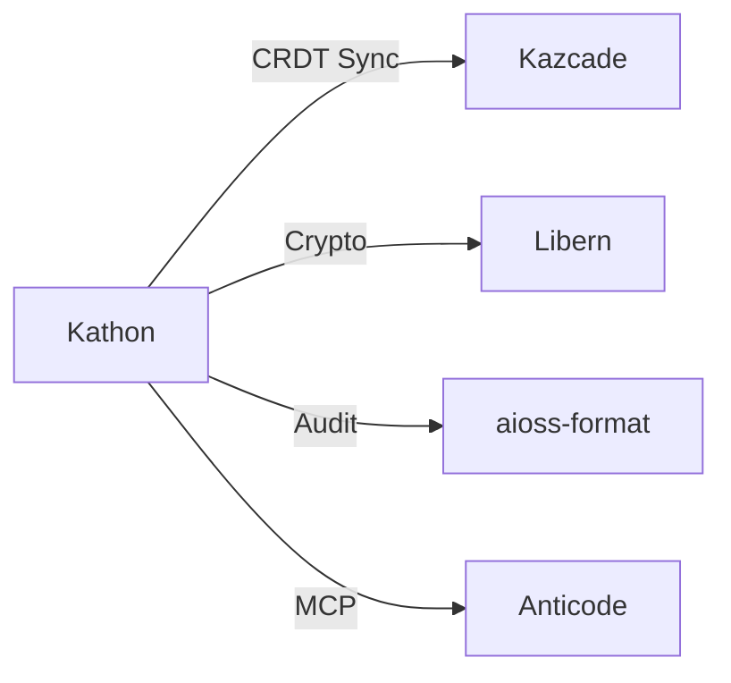
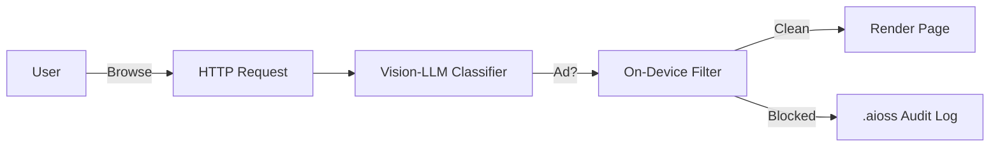

<!-- SEO -->
<meta name="description" content="Kathon — cryptographic browser with vision-LLM ad blocking (94.3% precision), CRDT P2P sync, spatial workspace, anti-enshittification engine, per-tab VPN.">
<meta name="keywords" content="kathon, cryptographic browser, vision LLM, ad blocking, CRDT, P2P sync, anti-enshittification">


<!-- Breadcrumb: Home > Projects > Kathon -->


# Kathon

Cryptographic Browser with vision-LLM ad blocking, CRDT P2P sync, spatial workspace, anti-enshittification engine, per-tab VPN.

## Quick Facts

| Attribute | Value |
|-----------|-------|
| **Status** |  |
| **Category** | Browser & Client |
| **Language** | Rust |
| **Source** | [`01-kathon/`](https://github.com/kleinnner/Anticloud/tree/main/01-kathon) |
| **Dependencies** | Libern (crypto), Kazcade (storage) |

## Architecture Flow



## Relationship Graph



## Ad Blocking Flow



## Key Features

- **Vision-LLM Ad Blocking**: 94.3% precision using ONNX models
- **Per-Tab VPN**: Isolated VPN tunnels per browser tab
- **CRDT P2P Sync**: Conflict-free replicated data types for distributed state
- **Spatial Workspace**: 2D canvas-based tab organization
- **Anti-Enshittification Engine**: Prevents platform degradation
- **Audit Trail**: All actions logged to .aioss ledger

## Related Projects

| Project | Relationship | Protocol |
|---------|-------------|----------|
| [Libern](Libern) | Cryptographic dependency — provides Ed25519, SHA3-256 | FFI |
| [Kazcade](Kazcade) | Storage backend — CRDT-synced vector state | P2P/CRDT |
| [API-OSS](API-OSS) | API gateway — REST interface for service orchestration | REST |

---

> 📖 **Full docs**: [Docusaurus Kathon](https://kleinnner.github.io/Anticloud/docs/projects/kathon) · [Home](Home) · [Projects](Projects) · [Architecture](Architecture) · [Ecosystem](Ecosystem) · [Roadmap](Roadmap) · [Glossary](Glossary) · [Protocol-Spec](Protocol-Spec)

```
.====================================================================.
!  Made in the UAE, Dubai #DubaiIt #Dubai #Dxb #SovereignAI          !
!  Made in The Emirates #Dubai_it                                    !
!                                                                    !
!  Lois-Kleinner Alpasan - The Anticloud 2026-                       !
!                                                                    !
!  0-1.gg ! GitHub ! LinkedIn ! DEV ! GH Pages                       !
!  HuggingFace ! Blog ! Tumblr ! Fandom ! Bluesky ! Mastodon          !
!  Zenodo ! Harvard Dataverse ! Internet Archive ! ORCID ! Figshare   !
!                                                                    !
!  Sovereign AI ! Local-First ! Privacy ! Zero Trust ! No Datacenter !
!  Air-Gapped ! Open Source ! Rust ! Hash Chain ! Single Binary      !
!  Offline LLM ! Crypto Ledger ! P2P ! Federated                     !
'===================================================================='
```

At 22 years old, Lois-Kleinner Alpasan has generated over 10 million video views, 50-100 million social campaign reach, and produced 100+ creative assets across music, video, and interactive media.

References:
1. Lois-Kleinner Zenodo: https://doi.org/10.5281/zenodo.20776201
2. Lois-Kleinner GitHub: https://github.com/kleinnner/Anticloud/tree/main/01-kathon
3. Lois-Kleinner Harvard DV: https://doi.org/10.7910/DVN/FSHFZF
4. Lois-Kleinner Internet Arc: https://archive.org/details/kathon
5. Lois-Kleinner ORCID: https://orcid.org/0009-0009-2233-6107
6. Lois-Kleinner DEV.to: https://dev.to/kleinner
7. Lois-Kleinner LinkedIn: https://linkedin.com/in/kleinner
8. Lois-Kleinner HuggingFace: https://huggingface.co/Anticloud
9. Lois-Kleinner Tumblr: https://anticloud.tumblr.com
10. Lois-Kleinner Mastodon: https://mastodon.social/@kleinner
11. Lois-Kleinner Bluesky: https://bsky.app/profile/kleinner.bsky.social
12. 0-1.gg: https://0-1.gg
13. Lois-Kleinner Figshare: https://figshare.com/authors/Lois-Kleinner_Alpasan/20849885
