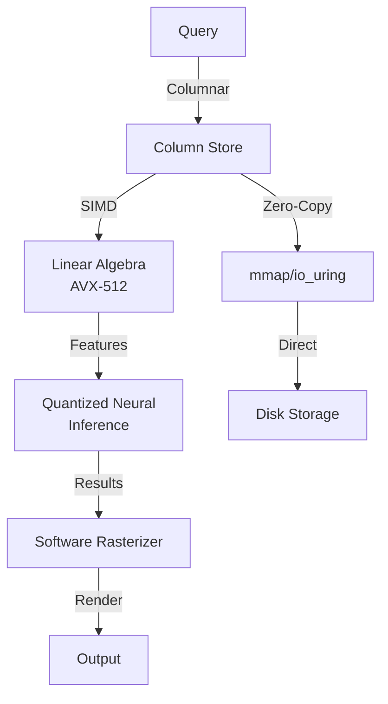
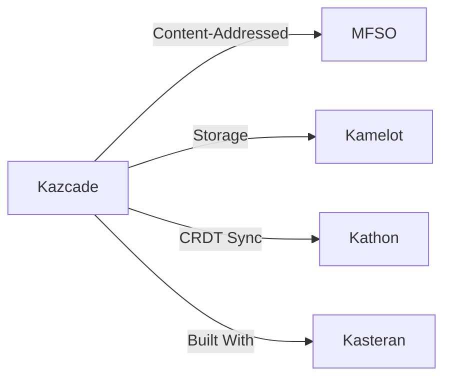

<!-- SEO -->
<meta name="description" content="Kazcade — CPU-only columnar compute engine with SIMD-accelerated linear algebra (AVX-512), quantized neural inference, software rasterizer, zero-copy mmap/io_uring.">
<meta name="keywords" content="kazcade, vector file system, content-addressed storage, VFS, distributed filesystem">

# Kazcade

CPU-Only Columnar Compute Engine with SIMD-accelerated linear algebra (AVX-512), quantized neural inference, software rasterizer, zero-copy mmap/io_uring architecture.

## Quick Facts

| Attribute | Value |
|-----------|-------|
| **Status** |  |
| **Category** | Storage & Search |
| **Language** | Rust |
| **Source** | [`09-kazcade/`](https://github.com/kleinnner/Anticloud/tree/main/09-kazcade) |
| **Dependencies** | Kasteran, Libern |

## Compute Pipeline

## Relationship Graph

## Key Features

- **Columnar Storage**: Optimized for analytical workloads
- **SIMD Acceleration**: AVX-512 linear algebra operations
- **Quantized Neural Inference**: Low-precision ML inference on CPU
- **Zero-Copy I/O**: mmap/io_uring for direct disk access
- **Software Rasterizer**: GPU-free rendering pipeline
- **CRDT Sync**: Conflict-free replication across nodes

---

> 📖 **Full docs**: [Docusaurus Kazcade](https://kleinnner.github.io/Anticloud/docs/projects/kazcade) · [Home](Home) · [Projects](Projects) · [Architecture](Architecture)
