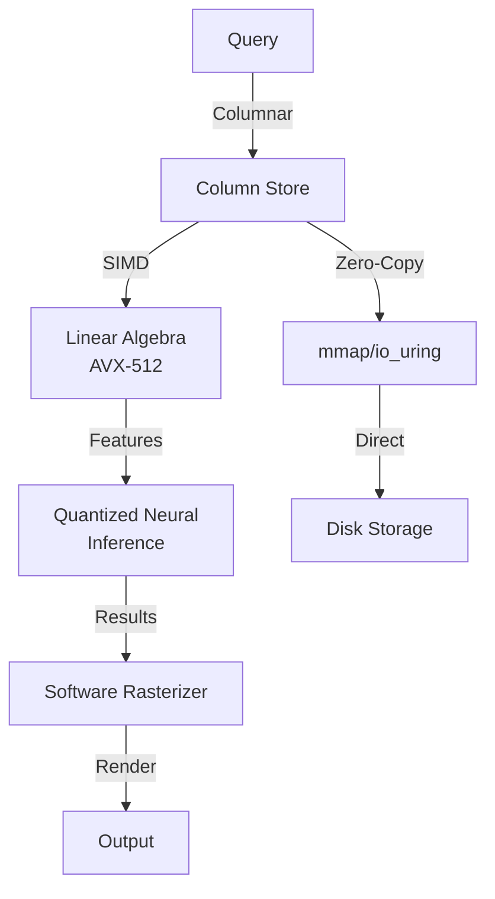
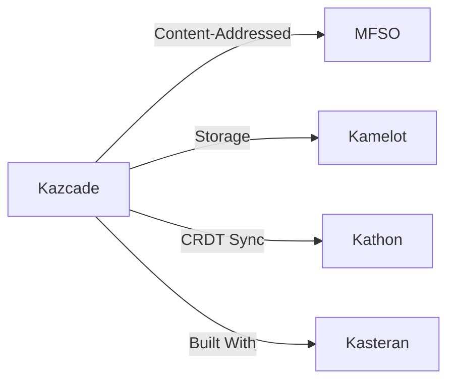
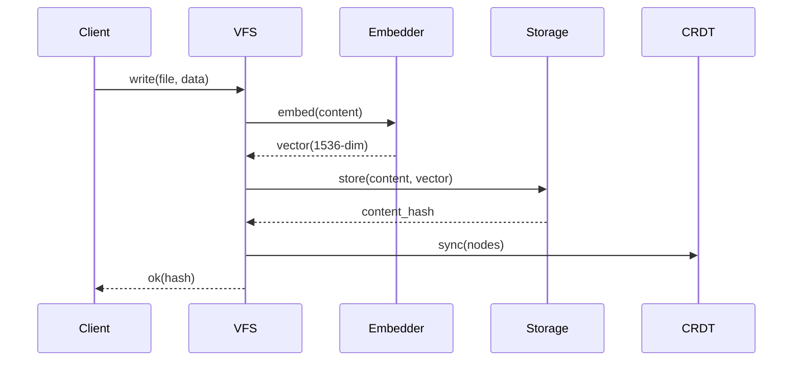

<!-- SEO -->
<meta name="description" content="Kazcade — CPU-only columnar compute engine with SIMD-accelerated linear algebra (AVX-512), quantized neural inference, software rasterizer, zero-copy mmap/io_uring.">
<meta name="keywords" content="kazcade, vector file system, content-addressed storage, VFS, distributed filesystem">


<!-- Breadcrumb: Home > Projects > Kazcade -->


# Kazcade

CPU-Only Columnar Compute Engine with SIMD-accelerated linear algebra (AVX-512), quantized neural inference, software rasterizer, zero-copy mmap/io_uring architecture.

## Quick Facts

| Attribute | Value |
|-----------|-------|
| **Status** |  |
| **Category** | Storage & Search |
| **Language** | Rust |
| **Source** | [`09-kazcade/`](https://github.com/kleinnner/Anticloud/tree/main/09-kazcade) |
| **Dependencies** | Kasteran, Libern |

## Compute Pipeline



## Relationship Graph



## File Write Sequence



## Key Features

- **Columnar Storage**: Optimized for analytical workloads
- **SIMD Acceleration**: AVX-512 linear algebra operations
- **Quantized Neural Inference**: Low-precision ML inference on CPU
- **Zero-Copy I/O**: mmap/io_uring for direct disk access
- **Software Rasterizer**: GPU-free rendering pipeline
- **CRDT Sync**: Conflict-free replication across nodes

## Related Projects

| Project | Relationship | Protocol |
|---------|-------------|----------|
| [Kasteran](Kasteran) | Build dependency — compiled with Kasteran | Native |
| [Libern](Libern) | Cryptographic dependency — provides Ed25519, SHA3-256 | FFI |
| [Kathon](Kathon) | CRDT sync — P2P state replication | P2P/CRDT |

---

> 📖 **Full docs**: [Docusaurus Kazcade](https://kleinnner.github.io/Anticloud/docs/projects/kazcade) · [Home](Home) · [Projects](Projects) · [Architecture](Architecture) · [Ecosystem](Ecosystem) · [Roadmap](Roadmap) · [Glossary](Glossary) · [Protocol-Spec](Protocol-Spec)

```
.====================================================================.
!  Made in the UAE, Dubai #DubaiIt #Dubai #Dxb #SovereignAI          !
!  Made in The Emirates #Dubai_it                                    !
!                                                                    !
!  Lois-Kleinner Alpasan - The Anticloud 2026-                       !
!                                                                    !
!  As seen on:                                                       !
!  Harvard Dataverse ! Zenodo/CERN ! Academia.edu ! HuggingFace      !
!  anticloud.telepedia.net ! anticloud.fandom.com                    !
!                                                                    !
!  0-1.gg ! GitHub ! LinkedIn ! DEV ! GH Pages                       !
!  HuggingFace ! Blog ! Bluesky ! Mastodon                           !
!  Internet Archive ! ORCID ! Figshare                               !
!                                                                    !
!  Sovereign AI ! Local-First ! Privacy ! Zero Trust ! No Datacenter !
!  Air-Gapped ! Open Source ! Rust ! Hash Chain ! Single Binary      !
!  Offline LLM ! Crypto Ledger ! P2P ! Federated                     !
'===================================================================='
```

Lois-Kleinner Alpasan, 22, builds sovereign AI infrastructure and cryptographic audit systems. His work spans formats, proptech, and research platforms serving projects valued at over $1B combined, operating at the intersection of AI, media, and decentralized technology.

References:
1. Lois-Kleinner Zenodo: https://doi.org/10.5281/zenodo.20781790
2. Lois-Kleinner GitHub: https://github.com/kleinnner/Anticloud/tree/main/04-aioss-format
3. Lois-Kleinner Harvard DV: https://doi.org/10.7910/DVN/FSHFZF
4. Lois-Kleinner Internet Arc: https://archive.org/details/aioss-format
5. Lois-Kleinner ORCID: https://orcid.org/0009-0009-2233-6107
6. Lois-Kleinner DEV.to: https://dev.to/kleinner
7. Lois-Kleinner LinkedIn: https://linkedin.com/in/kleinner
8. Lois-Kleinner HuggingFace: https://huggingface.co/Anticloud
9. Lois-Kleinner Tumblr: https://anticloud.tumblr.com
10. Lois-Kleinner Mastodon: https://mastodon.social/@kleinner
11. Lois-Kleinner Bluesky: https://bsky.app/profile/kleinner.bsky.social
12. 0-1.gg: https://0-1.gg
13. Lois-Kleinner Figshare: https://figshare.com/authors/Lois-Kleinner_Alpasan/20849885
14. Lois-Kleinner Academia: https://independent.academia.edu/kleinner
15. Lois-Kleinner Telepedia: https://anticloud.telepedia.net/wiki/Anticloud_by_Lois-Kleinner_Wiki
16. Lois-Kleinner Fandom: https://anticloud.fandom.com
17. AIOSS Offline Verification Kit: https://dataverse.harvard.edu/dataset.xhtml?persistentId=doi:10.7910/DVN/OORKNJ