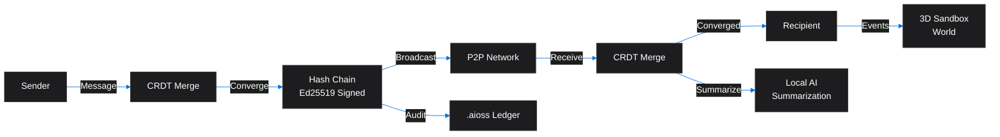
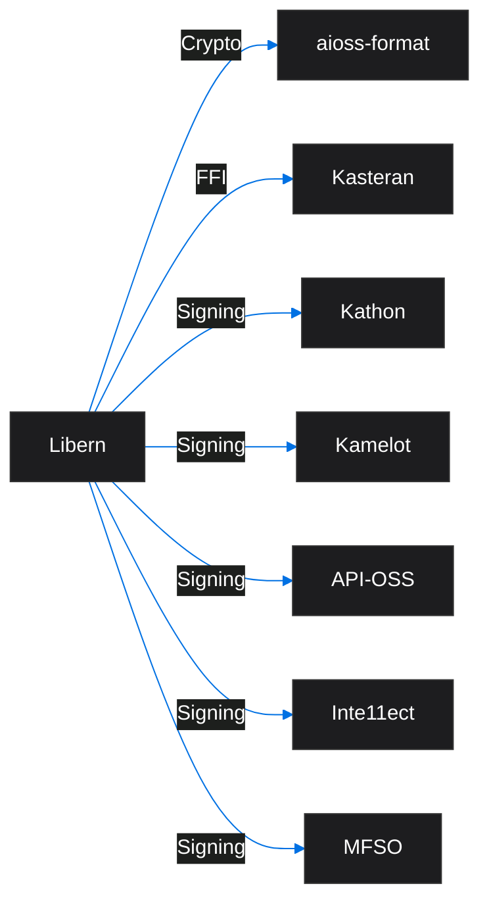
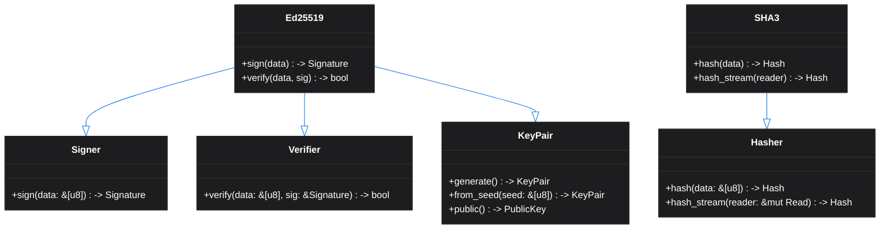

<!-- SEO -->
<meta name="description" content="Libern — P2P communication engine with CRDT convergence, Ed25519-signed hash chains, local AI summarization, 3D sandbox world, enterprise AI auditability.">
<meta name="keywords" content="libern, cryptographic library, Ed25519, SHA3, digital signatures, blockchain">

<!-- Breadcrumb: Home > Projects > Libern -->

# Libern

P2P Communication Engine with CRDT convergence, Ed25519-signed hash chains, local AI summarization, 3D sandbox world, and enterprise AI auditability framework.

## Quick Facts

| Attribute | Value |
|-----------|-------|
| **Status** |  |
| **Category** | Core Infrastructure |
| **Language** | Rust |
| **Source** | [`08-libern/`](https://github.com/kleinnner/Anticloud/tree/main/08-libern) |
| **Dependencies** | None (foundational library) |

## P2P Message Flow

## Relationship Graph

## Cryptographic Trait Hierarchy

## Key Features

- **CRDT Convergence**: Conflict-free replicated data types for P2P
- **Ed25519 Signatures**: Message signing and verification
- **Hash Chains**: Tamper-evident message history
- **Local AI Summarization**: On-device conversation summarization
- **3D Sandbox World**: Immersive spatial communication
- **Enterprise Auditability**: Framework for AI interaction auditing

## Related Projects

| Project | Relationship | Protocol |
|---------|-------------|----------|
| [Kathon](Kathon) | Consumer — browser crypto signing | FFI |
| [Kamelot](Kamelot) | Consumer — cloud runtime signing | FFI |
| [aioss-format](aioss-format) | Consumer — ledger state proofs | FFI |

---

> 📖 **Full docs**: [Docusaurus Libern](https://kleinnner.github.io/Anticloud/docs/projects/libern) · [Home](Home) · [Projects](Projects) · [Architecture](Architecture) · [Ecosystem](Ecosystem) · [Roadmap](Roadmap) · [Glossary](Glossary) · [Protocol-Spec](Protocol-Spec)
