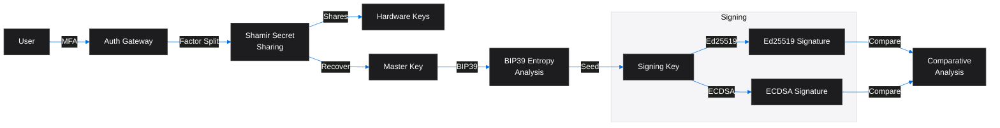
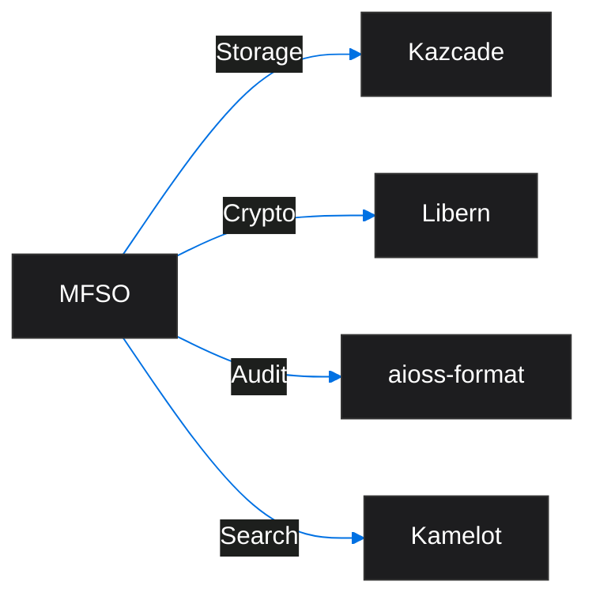
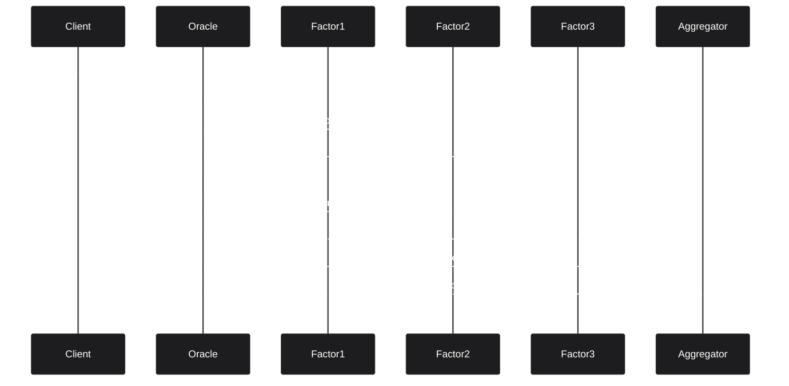

<!-- SEO -->
<meta name="description" content="MFSO — Multi-Factor Sovereign Sign-On identity vault with Shamir secret sharing, BIP39 entropy analysis, Ed25519 vs ECDSA comparative analysis, hardware-backed key storage.">
<meta name="keywords" content="MFSO, search oracle, sovereign search, encrypted search, identity vault">

<meta property="og:title" content="MFSO — Anticloud Wiki">
<meta property="og:description" content="MFSO — Multi-Factor Sovereign Sign-On identity vault with Shamir secret sharing, BIP39 entropy analysis, Ed25519 vs ECDSA comparative analysis, hardware-backed key storage.">
<meta property="og:image" content="https://kleinnner.github.io/Anticloud/img/og-image.png">
<meta property="og:type" content="website">
<meta name="twitter:card" content="summary_large_image">
<meta name="twitter:title" content="MFSO">
<meta name="twitter:description" content="MFSO — Multi-Factor Sovereign Sign-On identity vault with Shamir secret sharing, BIP39 entropy analysis, Ed25519 vs ECDSA comparative analysis, hardware-backed key storage.">
<link rel="canonical" href="https://github.com/kleinnner/Anticloud/wiki/MFSO">

<!-- Breadcrumb: Home > Projects > MFSO -->

# MFSO

Multi-Factor Sovereign Sign-On identity vault with Shamir secret sharing, BIP39 entropy analysis, Ed25519 vs ECDSA comparative analysis, and hardware-backed key storage.

## Quick Facts

| Attribute | Value |
|-----------|-------|
| **Status** |  |
| **Category** | Storage & Search |
| **Language** | Rust |
| **Source** | [`07-mfso/`](https://github.com/kleinnner/Anticloud/tree/main/07-mfso) |
| **Dependencies** | Kazcade, Libern |

## Identity Flow

## Relationship Graph

## Search Query Flow

## Key Features

- **Shamir Secret Sharing**: Split keys across multiple factors
- **BIP39 Entropy Analysis**: Mnemonic seed generation and validation
- **Ed25519 vs ECDSA**: Comparative signing analysis
- **Hardware-Backed Keys**: TPM and secure element integration
- **MFA Auth Gateway**: Multi-factor authentication pipeline
- **Identity Vault**: Sovereign self-custody of digital identity

## Related Projects

| Project | Relationship | Protocol |
|---------|-------------|----------|
| [Kazcade](Kazcade) | Storage backend — CRDT-synced vector state | P2P/CRDT |
| [Libern](Libern) | Cryptographic dependency — provides Ed25519, SHA3-256 | FFI |
| [Kamelot](Kamelot) | Search — cloud function orchestration | gRPC |

---

> 📖 **Full docs**: [Docusaurus MFSO](https://kleinnner.github.io/Anticloud/docs/projects/mfso) · [Home](Home) · [Projects](Projects) · [Architecture](Architecture) · [Ecosystem](Ecosystem) · [Roadmap](Roadmap) · [Glossary](Glossary) · [Protocol-Spec](Protocol-Spec)
