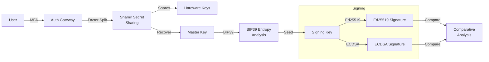
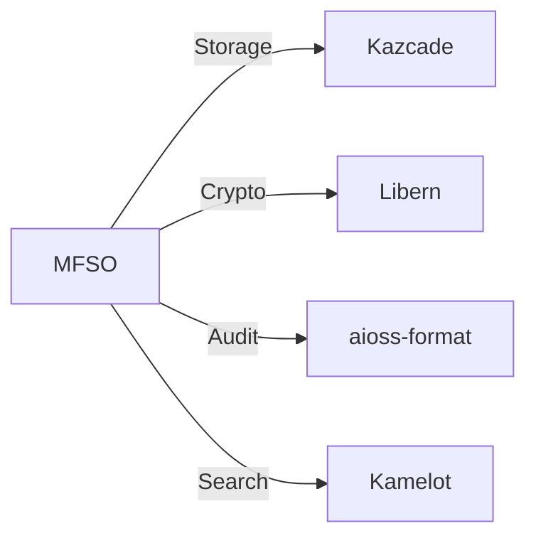

<!-- SEO -->
<meta name="description" content="MFSO — Multi-Factor Sovereign Sign-On identity vault with Shamir secret sharing, BIP39 entropy analysis, Ed25519 vs ECDSA comparative analysis, hardware-backed key storage.">
<meta name="keywords" content="MFSO, search oracle, sovereign search, encrypted search, identity vault">

# MFSO

Multi-Factor Sovereign Sign-On identity vault with Shamir secret sharing, BIP39 entropy analysis, Ed25519 vs ECDSA comparative analysis, and hardware-backed key storage.

## Quick Facts

| Attribute | Value |
|-----------|-------|
| **Status** |  |
| **Category** | Storage & Search |
| **Language** | Rust |
| **Source** | [`07-mfso/`](https://github.com/kleinnner/Anticloud/tree/main/07-mfso) |
| **Dependencies** | Kazcade, Libern |

## Identity Flow

## Relationship Graph

## Key Features

- **Shamir Secret Sharing**: Split keys across multiple factors
- **BIP39 Entropy Analysis**: Mnemonic seed generation and validation
- **Ed25519 vs ECDSA**: Comparative signing analysis
- **Hardware-Backed Keys**: TPM and secure element integration
- **MFA Auth Gateway**: Multi-factor authentication pipeline
- **Identity Vault**: Sovereign self-custody of digital identity

---

> 📖 **Full docs**: [Docusaurus MFSO](https://kleinnner.github.io/Anticloud/docs/projects/mfso) · [Home](Home) · [Projects](Projects) · [Architecture](Architecture)
