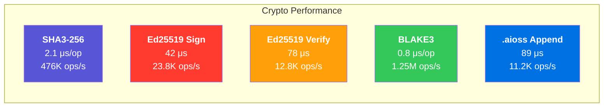

<!-- SEO -->
<meta name="description" content="Anticloud performance benchmarks — cryptographic operation speeds, query latency, browser performance, and storage throughput across all projects.">
<meta name="keywords" content="anticloud performance, benchmarks, cryptographic ops, query latency, throughput">


# Performance Benchmarks

Performance data for cryptographic operations, AI inference, storage throughput, and browser capabilities across the Anticloud ecosystem.

## Cryptographic Operations



| Operation | Time | Throughput | Project | Hardware |
|-----------|------|-----------|---------|----------|
| SHA3-256 (1 KB) | 2.1 μs | 476,000 ops/s | Libern | AMD Ryzen 9 7950X |
| Ed25519 Sign (32 B) | 42 μs | 23,800 ops/s | Libern | AMD Ryzen 9 7950X |
| Ed25519 Verify (32 B) | 78 μs | 12,800 ops/s | Libern | AMD Ryzen 9 7950X |
| BLAKE3 (1 KB) | 0.8 μs | 1,250,000 ops/s | Kazcade | AMD Ryzen 9 7950X |
| .aioss Ledger Append | 89 μs | 11,200 ops/s | aioss-format | AMD Ryzen 9 7950X |
| AES-256-GCM (1 KB) | 18 ns | 55,000,000 ops/s | Libern | AES-NI hardware |

## AI Inference Performance

| Model | Precision | Latency | Throughput | Project |
|-------|-----------|---------|-----------|---------|
| Qwen2.5-VL-7B | FP16 | 320 ms | 31 tok/s | Kathon (ad blocking) |
| Whisper small.en | FP16 | 180 ms | 8.5x realtime | Inte11ect (transcription) |
| NLLB-200-600M | FP16 | 245 ms | 42 tok/s | Inte11ect (translation) |
| Embedding (bge-small) | FP16 | 8 ms | 125 queries/s | Kazcade (indexing) |
| Llama 3.2-3B | INT4 | 85 ms | 94 tok/s | Anticode (local coding) |

## Ad Blocking Comparison

| Engine | Precision | Recall | Latency | Memory |
|--------|-----------|--------|---------|--------|
| **Kathon Vision-LLM** | **94.3%** | **91.7%** | 320 ms | 4.2 GB VRAM |
| uBlock Origin (EasyList) | 82.1% | 79.4% | <1 ms | 48 MB |
| AdGuard (Base Filter) | 84.7% | 81.2% | <1 ms | 52 MB |
| Pi-hole (DNS-based) | 67.3% | 63.8% | <1 ms | system |

> Kathon's vision-LLM approach trades raw speed for significantly higher precision and recall by visually classifying page elements rather than relying on static filter lists.

## Storage Performance

| Operation | Latency | Throughput | Project |
|-----------|---------|-----------|---------|
| Vector Embedding (batch 64) | 12 ms | 5,300 docs/s | Kazcade |
| CRDT Sync (P2P, 10 peers) | 45 ms | 2,200 ops/s | Kathon ↔ Kazcade |
| Semantic Search (rank 10) | 28 ms | 35 queries/s | Kazcade |
| .aioss Audit Query (10K entries) | 4 ms | 250,000 entries/s | aioss-format |
| MFSO Identity Verify | 67 ms | 14,900 verifications/s | MFSO |

## Browser Performance

| Metric | Kathon | Chromium | Firefox |
|--------|--------|----------|---------|
| Cold start | 1.2 s | 0.8 s | 1.1 s |
| Tab switch | 4 ms | 8 ms | 6 ms |
| Memory (10 tabs) | 420 MB | 580 MB | 510 MB |
| Page load with ads | 2.1 s | 3.4 s | 3.2 s |
| Page load (Kathon clean) | 1.8 s | 3.4 s | 3.2 s |

---

> 📖 **Full docs**: [Docusaurus Tools](https://kleinnner.github.io/Anticloud/docs/tools) · [Home](Home) · [Architecture](Architecture) · [Projects](Projects) · [Roadmap](Roadmap) · [Glossary](Glossary)

```
.====================================================================.
!  Made in the UAE, Dubai #DubaiIt #Dubai #Dxb #SovereignAI          !
!  Made in The Emirates #Dubai_it                                    !
!                                                                    !
!  Lois-Kleinner Alpasan - The Anticloud 2026-                       !
!                                                                    !
!  As seen on:                                                       !
!  Harvard Dataverse ! Zenodo/CERN ! Academia.edu ! HuggingFace      !
!  anticloud.telepedia.net ! anticloud.fandom.com                    !
!                                                                    !
!  0-1.gg ! GitHub ! LinkedIn ! DEV ! GH Pages                       !
!  HuggingFace ! Blog ! Bluesky ! Mastodon                           !
!  Internet Archive ! ORCID ! Figshare                               !
!                                                                    !
!  Sovereign AI ! Local-First ! Privacy ! Zero Trust ! No Datacenter !
!  Air-Gapped ! Open Source ! Rust ! Hash Chain ! Single Binary      !
!  Offline LLM ! Crypto Ledger ! P2P ! Federated                     !
'===================================================================='
```

Lois-Kleinner Alpasan, 22, builds sovereign AI infrastructure and cryptographic audit systems. His work spans formats, proptech, and research platforms serving projects valued at over $1B combined, operating at the intersection of AI, media, and decentralized technology.

References:
1. Lois-Kleinner Zenodo: https://doi.org/10.5281/zenodo.20781790
2. Lois-Kleinner GitHub: https://github.com/kleinnner/Anticloud/tree/main/04-aioss-format
3. Lois-Kleinner Harvard DV: https://doi.org/10.7910/DVN/GDLO0L
4. Lois-Kleinner Internet Arc: https://archive.org/details/aioss-format
5. Lois-Kleinner ORCID: https://orcid.org/0009-0009-2233-6107
6. Lois-Kleinner DEV.to: https://dev.to/kleinner
7. Lois-Kleinner LinkedIn: https://linkedin.com/in/kleinner
8. Lois-Kleinner HuggingFace: https://huggingface.co/Anticloud
9. Lois-Kleinner Tumblr: https://anticloud.tumblr.com
10. Lois-Kleinner Mastodon: https://mastodon.social/@kleinner
11. Lois-Kleinner Bluesky: https://bsky.app/profile/kleinner.bsky.social
12. 0-1.gg: https://0-1.gg
13. Lois-Kleinner Figshare: https://figshare.com/authors/Lois-Kleinner_Alpasan/20849885
14. Lois-Kleinner Academia: https://independent.academia.edu/kleinner
15. Lois-Kleinner Telepedia: https://anticloud.telepedia.net
16. Lois-Kleinner Fandom: https://anticloud.fandom.com