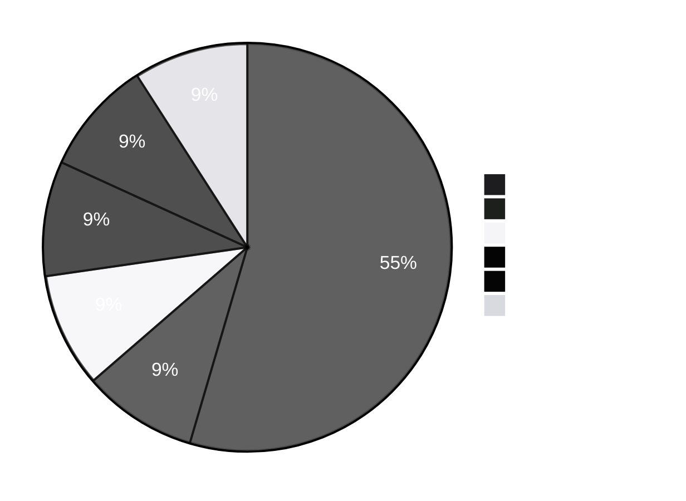
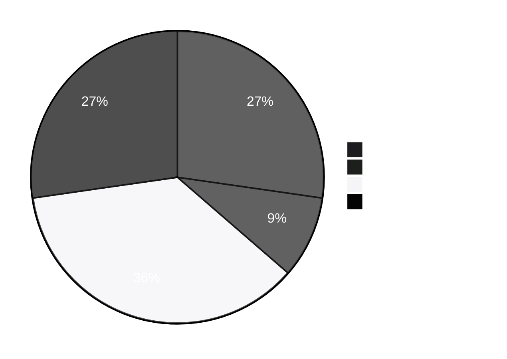
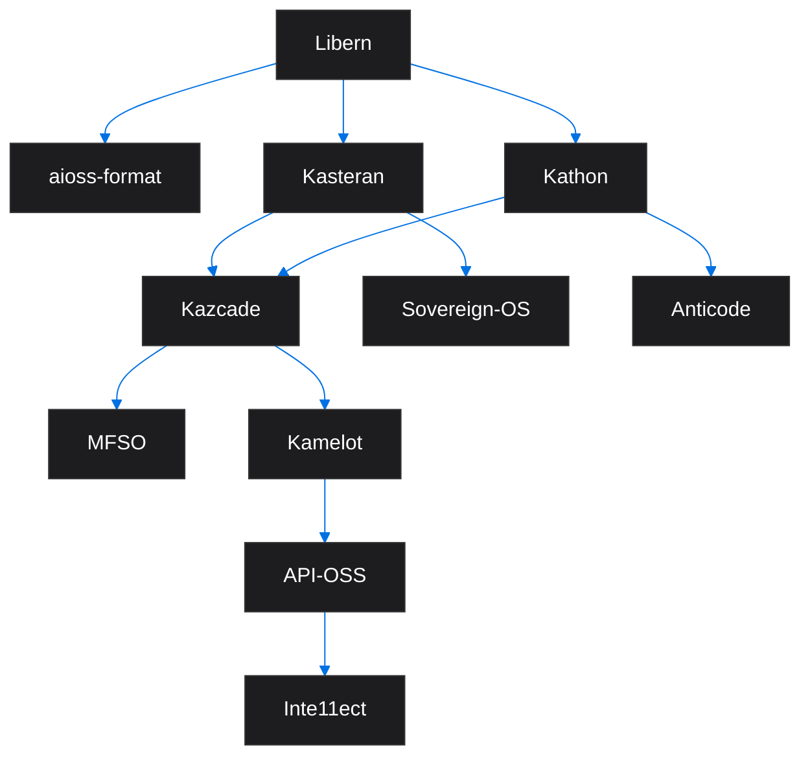

<!-- SEO -->
<meta name="description" content="Anticloud platform projects — 11 open-source projects status, tech stacks, language distribution, and inter-project dependency graph.">
<meta name="keywords" content="anticloud projects, kathon, kamelot, kasteran, kazcade, api-oss, inte11ect, aioss-format, libern, anticode, sovereign-os, mfso">


<!-- Breadcrumb: Home > Projects -->


# Platform Projects

The Anticloud ecosystem includes 11 platform projects spanning browsers, cloud infrastructure, programming languages, storage systems, and operating systems.

## Project Domain Map

```mermaid
%%{init: { 'theme': 'base', 'themeVariables': { 'primaryColor': '#1d1d1f', 'primaryTextColor': '#fff', 'primaryBorderColor': '#333', 'lineColor': '#0071e3', 'tertiaryColor': '#f5f5f7' } }}%%
flowchart LR
    subgraph Browser[Browser & Client]
        KATHON[Kathon<br/>]
        ANTICODE[Anticode<br/>]
    end
    subgraph Cloud[Cloud & AI]
        KAMELOT[Kamelot<br/>]
        APIOSS[API-OSS<br/>]
        INTE11ECT[Inte11ect<br/>]
    end
    subgraph Storage[Storage & Search]
        KAZCADE[Kazcade<br/>]
        MFSO[MFSO<br/>]
    end
    subgraph Core[Core Infrastructure]
        KASTERAN[Kasteran<br/>]
        SOVEREIGNOS[Sovereign-OS<br/>]
        AIOSS[aioss-format<br/>]
        LIBERN[Libern<br/>]
    end
```

## Distribution





##  Stable Projects

| Project | Status | Description | Language |
|---------|--------|-------------|----------|
| [API-OSS](API-OSS) |  | Open-source API gateway with sovereign engine | Rust |
| [aioss-format](aioss-format) |  | Tamper-evident proof-of-usefulness ledger | JSON |
| [Libern](Libern) |  | Cryptographic library (Ed25519, SHA3) | Rust |

##  Beta Projects

| Project | Status | Description | Language |
|---------|--------|-------------|----------|
| [Kathon](Kathon) |  | Cryptographic browser with vision-LLM ad blocking | Rust |

##  Alpha Projects

| Project | Status | Description | Language |
|---------|--------|-------------|----------|
| [Kamelot](Kamelot) |  | Cloud runtime & AI orchestration | Rust |
| [Kasteran](Kasteran) |  | Rune-based systems language | Rust |
| [Inte11ect](Inte11ect) |  | AI gateway & model router | Go |
| [Anticode](Anticode) |  | AI-native IDE | TypeScript |

##  Experimental Projects

| Project | Status | Description | Language |
|---------|--------|-------------|----------|
| [Kazcade](Kazcade) |  | Vector file system | Rust |
| [MFSO](MFSO) |  | Multi-Factor Search Oracle | Rust |
| [Sovereign-OS](Sovereign-OS) |  | Privacy-first operating system | Linux |

## Inter-Project Dependencies



---

> 📖 **Full docs**: [Docusaurus Projects](https://kleinnner.github.io/Anticloud/docs/projects) · [Home](Home) · [Architecture](Architecture) · [Tools](Tools) · [Ecosystem](Ecosystem) · [Roadmap](Roadmap) · [Glossary](Glossary) · [Security](Security)
