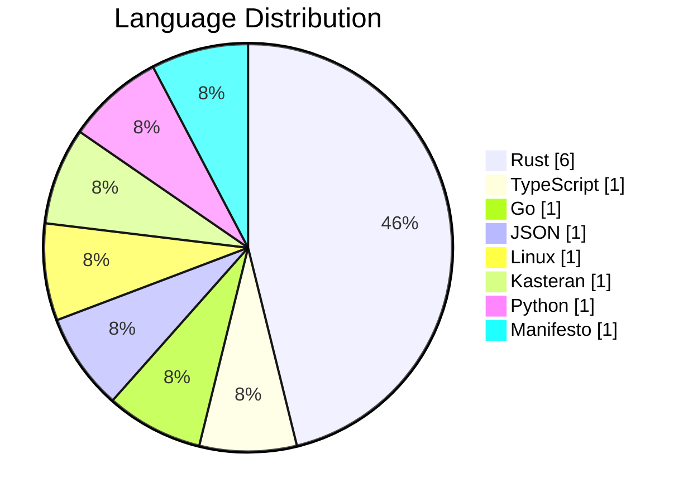
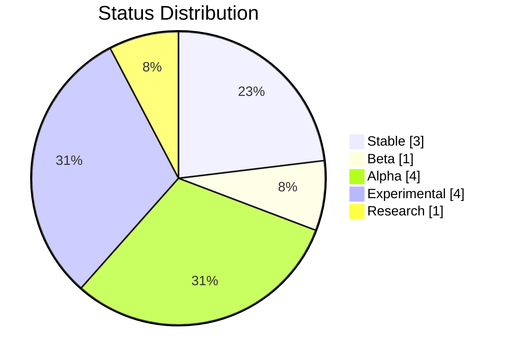
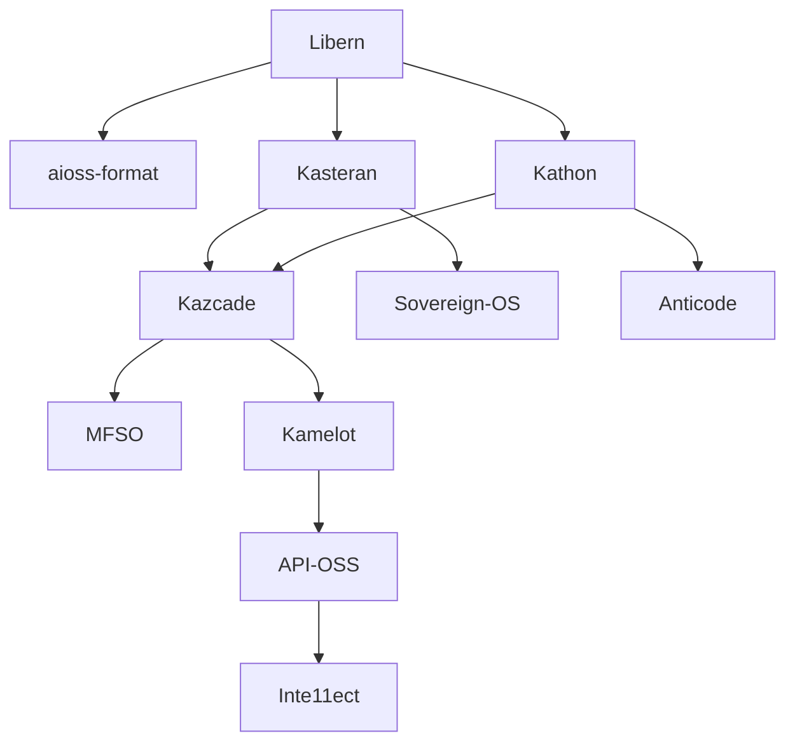

<!-- SEO -->
<meta name="description" content="Anticloud platform projects — 11 open-source projects status, tech stacks, language distribution, and inter-project dependency graph.">
<meta name="keywords" content="anticloud projects, kathon, kamelot, kasteran, kazcade, api-oss, inte11ect, aioss-format, libern, anticode, sovereign-os, mfso">


<!-- Breadcrumb: Home > Projects -->


[](https://dataverse.harvard.edu/dataverse/anticloud)
[](https://zenodo.org/search?q=anticloud)

# Platform Projects

The Anticloud ecosystem includes 13 platform projects spanning browsers, cloud infrastructure, programming languages, storage systems, operating systems, AI, and philosophical foundations.

## Project Domain Map

```mermaid
flowchart LR
    subgraph Browser[Browser & Client]
        KATHON[Kathon<br/>]
        ANTICODE[Anticode<br/>]
    end
    subgraph Cloud[Cloud & AI]
        KAMELOT[Kamelot<br/>]
        APIOSS[API-OSS<br/>]
        INTE11ECT[Inte11ect<br/>]
        CAMUS[Camus<br/>]
    end
    subgraph Storage[Storage & Search]
        KAZCADE[Kazcade<br/>]
        MFSO[MFSO<br/>]
    end
    subgraph Core[Core Infrastructure]
        KASTERAN[Kasteran<br/>]
        SOVEREIGNOS[Sovereign-OS<br/>]
        AIOSS[aioss-format<br/>]
        LIBERN[Libern<br/>]
    end
    subgraph Philosophy[Philosophy]
        DAAS[ΔaaS<br/>]
    end
```

## Distribution





##  Stable Projects

| Project | Status | Description | Language |
|---------|--------|-------------|----------|
| [API-OSS](API-OSS) |  | Open-source API gateway with sovereign engine | Rust |
| [aioss-format](aioss-format) |  | Tamper-evident proof-of-usefulness ledger | JSON |
| [Libern](Libern) |  | Cryptographic library (Ed25519, SHA3) | Rust |

##  Beta Projects

| Project | Status | Description | Language |
|---------|--------|-------------|----------|
| [Kathon](Kathon) |  | Cryptographic browser with vision-LLM ad blocking | Rust |

##  Alpha Projects

| Project | Status | Description | Language |
|---------|--------|-------------|----------|
| [Kamelot](Kamelot) |  | Cloud runtime & AI orchestration | Rust |
| [Kasteran](Kasteran) |  | Rune-based systems language | Rust |
| [Inte11ect](Inte11ect) |  | AI gateway & model router | Go |
| [Anticode](Anticode) |  | AI-native IDE | TypeScript |

##  Experimental Projects

| Project | Status | Description | Language |
|---------|--------|-------------|----------|
| [Kazcade](Kazcade) |  | Vector file system | Rust |
| [Camus](Camus) |  | Terminal-native vision-language AI shell | Python |
| [MFSO](MFSO) |  | Multi-Factor Search Oracle | Rust |
| [Sovereign-OS](Sovereign-OS) |  | Privacy-first operating system | Linux |

##  Research Projects

| Project | Status | Description | Language |
|---------|--------|-------------|----------|
| [ΔaaS](DeltaaaS) |  | Post-cloud superposition computing manifesto | Manifesto |

## Inter-Project Dependencies



---

> 📖 **Full docs**: [Docusaurus Projects](https://kleinnner.github.io/Anticloud/docs/projects) · [Home](Home) · [Architecture](Architecture) · [Tools](Tools) · [Ecosystem](Ecosystem) · [Roadmap](Roadmap) · [Glossary](Glossary) · [Security](Security)

```
.====================================================================.
!  Made in the UAE, Dubai #DubaiIt #Dubai #Dxb #SovereignAI          !
!  Made in The Emirates #Dubai_it                                    !
!                                                                    !
!  Lois-Kleinner Alpasan - The Anticloud 2026-                       !
!                                                                    !
!  As seen on:                                                       !
!  Harvard Dataverse ! Zenodo/CERN ! Academia.edu ! HuggingFace      !
!  anticloud.telepedia.net ! anticloud.fandom.com                    !
!                                                                    !
!  0-1.gg ! GitHub ! LinkedIn ! DEV ! GH Pages                       !
!  HuggingFace ! Blog ! Bluesky ! Mastodon                           !
!  Internet Archive ! ORCID ! Figshare                               !
!                                                                    !
!  Sovereign AI ! Local-First ! Privacy ! Zero Trust ! No Datacenter !
!  Air-Gapped ! Open Source ! Rust ! Hash Chain ! Single Binary      !
!  Offline LLM ! Crypto Ledger ! P2P ! Federated                     !
'===================================================================='
```

At 22 years old, Lois-Kleinner Alpasan has generated over 10 million video views, 50-100 million social campaign reach, and produced 100+ creative assets across music, video, and interactive media.

References:
1. Lois-Kleinner Zenodo: https://doi.org/10.5281/zenodo.20781790
2. Lois-Kleinner GitHub: https://github.com/kleinnner/Anticloud/tree/main/04-aioss-format
3. Lois-Kleinner Harvard DV: https://doi.org/10.7910/DVN/FDEBAB
4. Lois-Kleinner Internet Arc: https://archive.org/details/aioss-format
5. Lois-Kleinner ORCID: https://orcid.org/0009-0009-2233-6107
6. Lois-Kleinner DEV.to: https://dev.to/kleinner
7. Lois-Kleinner LinkedIn: https://linkedin.com/in/kleinner
8. Lois-Kleinner HuggingFace: https://huggingface.co/Anticloud
9. Lois-Kleinner Tumblr: https://anticloud.tumblr.com
10. Lois-Kleinner Mastodon: https://mastodon.social/@kleinner
11. Lois-Kleinner Bluesky: https://bsky.app/profile/kleinner.bsky.social
12. 0-1.gg: https://0-1.gg
13. Lois-Kleinner Figshare: https://figshare.com/authors/Lois-Kleinner_Alpasan/20849885
14. Lois-Kleinner Academia: https://independent.academia.edu/kleinner
15. Lois-Kleinner Telepedia: https://anticloud.telepedia.net/wiki/Anticloud_by_Lois-Kleinner_Wiki
16. Lois-Kleinner Fandom: https://anticloud.fandom.com