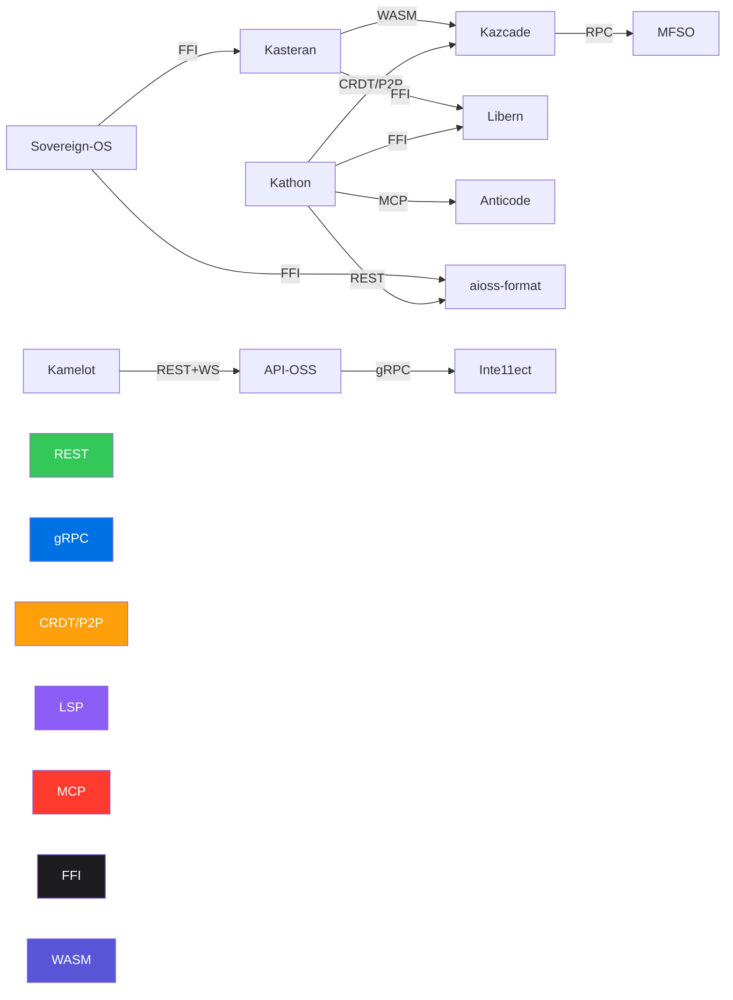

<!-- SEO -->
<meta name="description" content="Anticloud inter-project protocol specifications — REST, gRPC, WebSocket, CRDT/P2P, LSP, MCP, FFI connections across all 11 projects.">
<meta name="keywords" content="anticloud protocol, REST API, gRPC, CRDT, P2P, LSP, MCP, FFI, inter-project communication">


# Protocol Specifications

The Anticloud ecosystem uses 7 distinct protocols for inter-project communication. This page documents each protocol's role, transport, and data flow.

## Protocol Map



## Protocol Matrix

| # | Source | Target | Protocol | Transport | Purpose |
|---|--------|--------|----------|-----------|---------|
| 1 | Kathon | Kazcade | CRDT/P2P | QUIC / WebRTC | Distributed state synchronization |
| 2 | Kathon | Libern | FFI | Native binding | Cryptographic operations |
| 3 | Kathon | Anticode | MCP | stdio / TCP | AI agent tool execution |
| 4 | Kathon | aioss-format | REST | HTTP/2 | Audit trail append |
| 5 | Kamelot | API-OSS | REST + WebSocket | HTTP/2 + WS | Service orchestration & events |
| 6 | API-OSS | Inte11ect | gRPC | HTTP/2 streaming | AI model routing |
| 7 | Kasteran | Libern | FFI | Native binding | Crypto primitives for compiler |
| 8 | Kasteran | Kazcade | WASM | WebAssembly | Sandboxed plugin execution |
| 9 | Sovereign-OS | aioss-format | FFI | Kernel-level syscall | Boot attestation ledger |
| 10 | Sovereign-OS | Kasteran | FFI | Kernel-level syscall | System language runtime |
| 11 | Kazcade | MFSO | RPC | TCP | Search query routing |
| 12 | Anticode | Kathon | LSP | TCP | Language intelligence |
| 13 | Kamelot | Kazcade | REST | HTTP/2 | Storage backend access |
| 14 | Inte11ect | Kazcade | gRPC | HTTP/2 | Embedding storage & retrieval |

## Protocol Details

### REST (HTTP/2)

Used for request-response communication between services. API-OSS serves as the primary REST gateway.

- **Endpoints**: `/api/v1/{resource}`
- **Auth**: Ed25519-signed requests (header: `Authorization: Ed25519 {signature}`)
- **Content-Type**: `application/json` or `application/cbor`
- **Used by**: Kathon ↔ aioss-format, Kamelot ↔ API-OSS, Kamelot ↔ Kazcade

### gRPC + WebSocket (HTTP/2 Streaming)

Used for high-throughput streaming and bidirectional communication.

- **Service definitions**: Protocol Buffers v3 (`.proto` files in `06-api-oss/proto/`)
- **Streaming**: Server-side streaming for model inference, bidirectional for real-time collaboration
- **Used by**: API-OSS ↔ Inte11ect, Inte11ect ↔ Kazcade

### CRDT over P2P (QUIC / WebRTC)

Used for distributed state synchronization without central coordination.

- **CRDT type**: Last-Writer-Wins Register + Multi-Value Register + Grow-only Set
- **Transport**: QUIC (reliable) or WebRTC (browser-compatible)
- **Conflict resolution**: Lamport timestamps + Merkle clock
- **Used by**: Kathon ↔ Kazcade

### LSP (Language Server Protocol)

Used for editor-agnostic language intelligence.

- **Capabilities**: Completion, hover, go-to-definition, references, diagnostics
- **Transport**: TCP (default) or stdio
- **Used by**: Anticode ↔ Kasteran

### MCP (Model Context Protocol)

Used for AI agent tool execution and model interaction.

- **Resources**: Files, databases, browser state
- **Tools**: Code execution, file editing, web search
- **Sampling**: Model inference requests
- **Used by**: Anticode ↔ Kathon

### FFI (Foreign Function Interface)

Used for direct native function calls between projects written in the same or compatible languages.

- **Calling convention**: C ABI (via `#[no_mangle]` in Rust)
- **Memory safety**: Shared ownership via `Arc<>`, no `unsafe` exposure
- **Used by**: Kathon ↔ Libern, Kasteran ↔ Libern, Sovereign-OS ↔ aioss-format, Sovereign-OS ↔ Kasteran

### WASM (WebAssembly)

Used for sandboxed plugin execution across language boundaries.

- **Runtime**: Wasmtime (standalone) / Wasmer (embedded)
- **Capabilities**: WASI preview 2 with restricted fs/network access
- **Used by**: Kasteran → Kazcade (plugin sandbox)

---

> 📖 **Full docs**: [Docusaurus Intro](https://kleinnner.github.io/Anticloud/docs/intro) · [Home](Home) · [Architecture](Architecture) · [Projects](Projects) · [Security](Security) · [Glossary](Glossary)

```
.====================================================================.
!  Made in the UAE, Dubai #DubaiIt #Dubai #Dxb #SovereignAI          !
!  Made in The Emirates #Dubai_it                                    !
!                                                                    !
!  Lois-Kleinner Alpasan - The Anticloud 2026-                       !
!                                                                    !
!  As seen on:                                                       !
!  Harvard Dataverse ! Zenodo/CERN ! Academia.edu ! HuggingFace      !
!  anticloud.telepedia.net ! anticloud.fandom.com                    !
!                                                                    !
!  0-1.gg ! GitHub ! LinkedIn ! DEV ! GH Pages                       !
!  HuggingFace ! Blog ! Bluesky ! Mastodon                           !
!  Internet Archive ! ORCID ! Figshare                               !
!                                                                    !
!  Sovereign AI ! Local-First ! Privacy ! Zero Trust ! No Datacenter !
!  Air-Gapped ! Open Source ! Rust ! Hash Chain ! Single Binary      !
!  Offline LLM ! Crypto Ledger ! P2P ! Federated                     !
'===================================================================='
```

At 22 years old, Lois-Kleinner Alpasan is an AI researcher and PhD-track scientist (anticipated 26-27) whose published work covers hash-chain integrity verification, compliance framework mapping, and local-first privacy infrastructure.

References:
1. Lois-Kleinner Zenodo: https://doi.org/10.5281/zenodo.20781790
2. Lois-Kleinner GitHub: https://github.com/kleinnner/Anticloud/tree/main/04-aioss-format
3. Lois-Kleinner Harvard DV: https://doi.org/10.7910/DVN/YMJKOG
4. Lois-Kleinner Internet Arc: https://archive.org/details/aioss-format
5. Lois-Kleinner ORCID: https://orcid.org/0009-0009-2233-6107
6. Lois-Kleinner DEV.to: https://dev.to/kleinner
7. Lois-Kleinner LinkedIn: https://linkedin.com/in/kleinner
8. Lois-Kleinner HuggingFace: https://huggingface.co/Anticloud
9. Lois-Kleinner Tumblr: https://anticloud.tumblr.com
10. Lois-Kleinner Mastodon: https://mastodon.social/@kleinner
11. Lois-Kleinner Bluesky: https://bsky.app/profile/kleinner.bsky.social
12. 0-1.gg: https://0-1.gg
13. Lois-Kleinner Figshare: https://figshare.com/authors/Lois-Kleinner_Alpasan/20849885
14. Lois-Kleinner Academia: https://independent.academia.edu/kleinner
15. Lois-Kleinner Telepedia: https://anticloud.telepedia.net/wiki/Anticloud_by_Lois-Kleinner_Wiki
16. Lois-Kleinner Fandom: https://anticloud.fandom.com