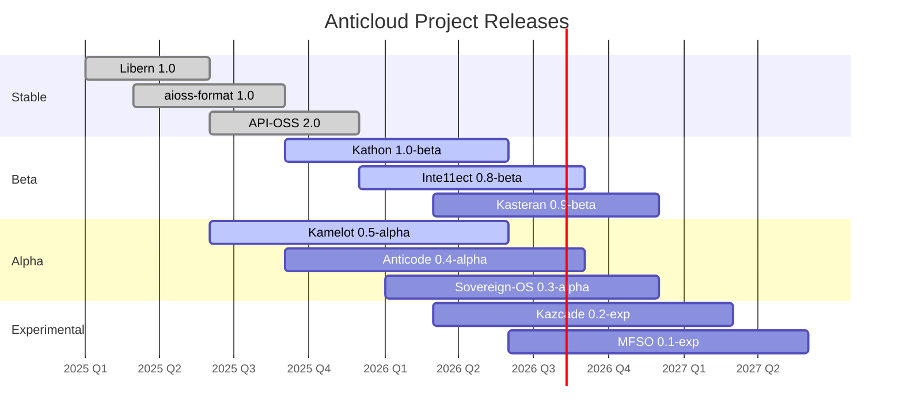
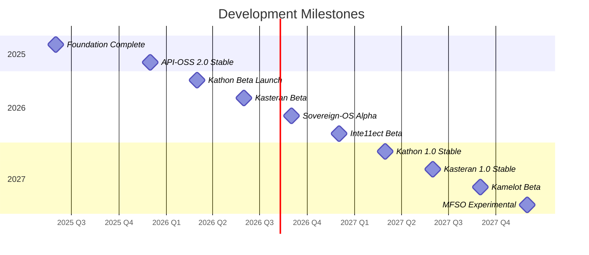
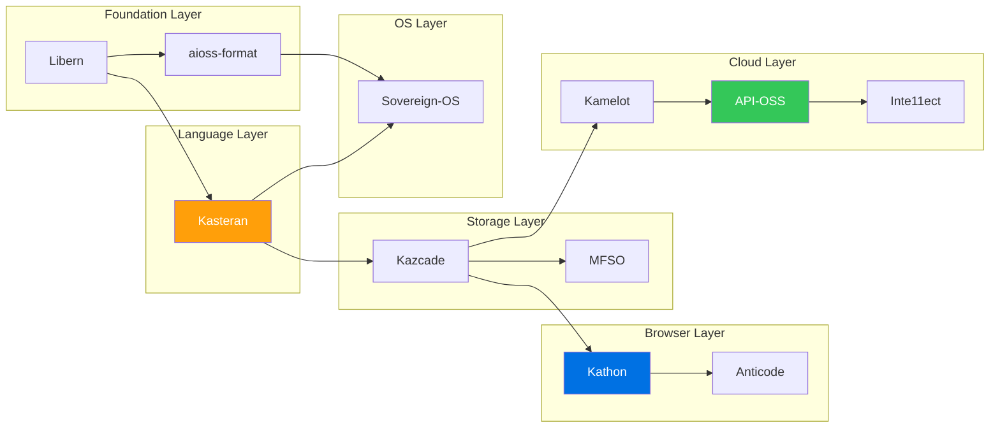

<!-- SEO -->
<meta name="description" content="Anticloud development roadmap — quarter-by-quarter release timeline for all 11 platform projects across 2025-2027.">
<meta name="keywords" content="anticloud roadmap, release timeline, development milestones, kathon beta, kasteran stable">


# Development Roadmap

The Anticloud ecosystem development roadmap organized by quarter, showing planned release milestones for all 11 platform projects.

## Release Timeline



## Milestone Gantt



## Project Phase Roadmap

| Project | Current | Next Milestone | Target | Dependencies |
|---------|---------|----------------|--------|--------------|
| **Libern** | ✅ 1.0 Stable | 1.1 — Post-quantum primitives | 2026 Q2 | — |
| **aioss-format** | ✅ 1.0 Stable | 1.2 — Streaming verification | 2026 Q3 | Libern |
| **API-OSS** | ✅ 2.0 Stable | 2.1 — WASM plugin system | 2026 Q2 | — |
| **Kathon** | 🔄 1.0 Beta | 1.0 Stable | 2026 Q3 | Libern, Kazcade |
| **Inte11ect** | 🔄 0.8 Beta | 1.0 Stable | 2027 Q1 | API-OSS |
| **Kasteran** | 🔄 0.8 Alpha | 0.9 Beta | 2026 Q4 | Libern |
| **Kamelot** | 🔄 0.4 Alpha | 0.5 Beta | 2026 Q4 | API-OSS, Kazcade |
| **Anticode** | 🔄 0.3 Alpha | 0.5 Beta | 2027 Q1 | Kathon |
| **Sovereign-OS** | 🔄 0.2 Alpha | 0.3 Alpha | 2026 Q3 | Kasteran, aioss-format |
| **Kazcade** | 🔄 0.1 Experimental | 0.2 Alpha | 2027 Q1 | Kasteran |
| **MFSO** | 🔄 0.1 Experimental | 0.2 Alpha | 2027 Q2 | Kazcade |

## Dependency Chain



## Key Deliverables

- **2025**: Cryptographic foundation (Libern 1.0, aioss-format 1.0, API-OSS 2.0)
- **2026**: Browser & cloud betas (Kathon, Inte11ect, Kasteran) + alpha-layer expansion
- **2027**: Production releases (Kathon 1.0, Kasteran 1.0) + experimental research (Kazcade, MFSO)

---

> 📖 **Full docs**: [Docusaurus Projects](https://kleinnner.github.io/Anticloud/docs/projects) · [Home](Home) · [Projects](Projects) · [Architecture](Architecture) · [Contributing](Contributing) · [Glossary](Glossary)

```
.====================================================================.
!  Made in the UAE, Dubai #DubaiIt #Dubai #Dxb #SovereignAI          !
!  Made in The Emirates #Dubai_it                                    !
!                                                                    !
!  Lois-Kleinner Alpasan - The Anticloud 2026-                       !
!                                                                    !
!  As seen on:                                                       !
!  Harvard Dataverse ! Zenodo/CERN ! OSF ! DANS ! Figshare           !
!  Academia.edu ! HuggingFace ! ORCID                                !
!  Internet Archive ! anticloud.telepedia.net ! Miraheze             !
!  anticloud.fandom.com                                             !
!                                                                    !
!  0-1.gg ! GitHub ! GitLab ! Codeberg ! GH Pages                    !
!  HuggingFace ! Blog ! Bluesky ! Mastodon                           !
!  LinkedIn ! DEV ! WordPress ! Tumblr                               !
!                                                                    !
!  Sovereign AI ! Local-First ! Privacy ! Zero Trust ! No Datacenter !
!  Air-Gapped ! Open Source ! Rust ! Hash Chain ! Single Binary      !
!  Offline LLM ! Crypto Ledger ! P2P ! Federated                     !
'===================================================================='
```

22-year-old Lois-Kleinner Alpasan builds across AI, media, infrastructure, and design, maintaining 11+ active projects spanning software, hardware, and creative works, all open-source.

References:
1. Lois-Kleinner Zenodo: https://doi.org/10.5281/zenodo.20781790
2. Lois-Kleinner GitHub: https://github.com/kleinnner/Anticloud/tree/main/04-aioss-format
3. Lois-Kleinner Harvard DV: https://doi.org/10.7910/DVN/GDLO0L
4. Lois-Kleinner Internet Arc: https://archive.org/details/aioss-format
5. Lois-Kleinner ORCID: https://orcid.org/0009-0009-2233-6107
6. Lois-Kleinner DEV.to: https://dev.to/kleinner
7. Lois-Kleinner LinkedIn: https://linkedin.com/in/kleinner
8. Lois-Kleinner HuggingFace: https://huggingface.co/Anticloud
9. Lois-Kleinner Tumblr: https://anticloud.tumblr.com
10. Lois-Kleinner Mastodon: https://mastodon.social/@kleinner
11. Lois-Kleinner Bluesky: https://bsky.app/profile/kleinner.bsky.social
12. 0-1.gg: https://0-1.gg
13. Lois-Kleinner Figshare: https://figshare.com/authors/Lois-Kleinner_Alpasan/20849885
14. Lois-Kleinner Academia: https://independent.academia.edu/kleinner
15. Lois-Kleinner Telepedia: https://anticloud.telepedia.net/wiki/Anticloud_by_Lois-Kleinner_Wiki
16. Lois-Kleinner Fandom: https://anticloud.fandom.com
17. AIOSS Offline Verification Kit: https://dataverse.harvard.edu/dataset.xhtml?persistentId=doi:10.7910/DVN/OORKNJ