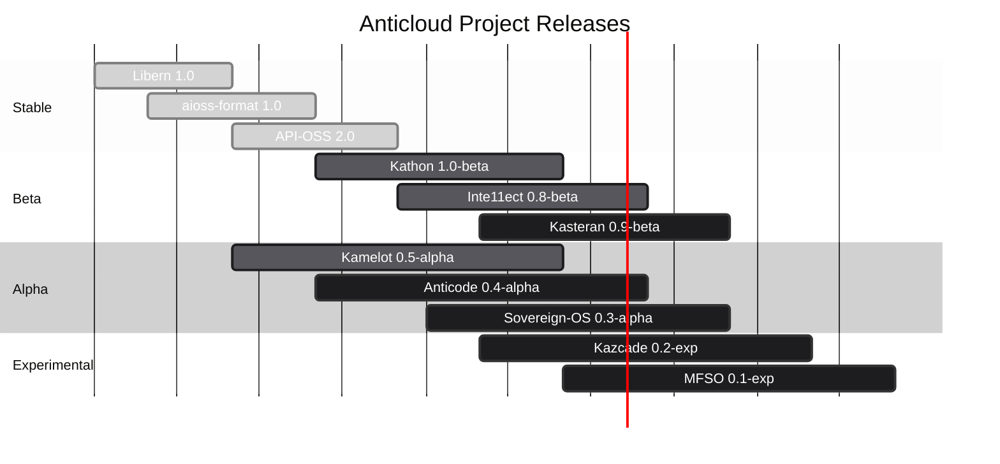
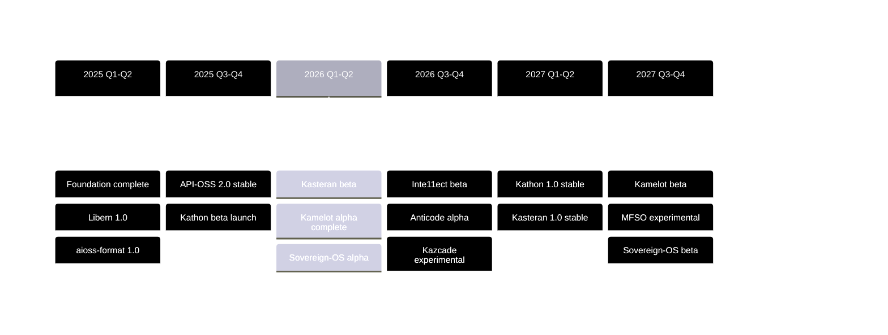
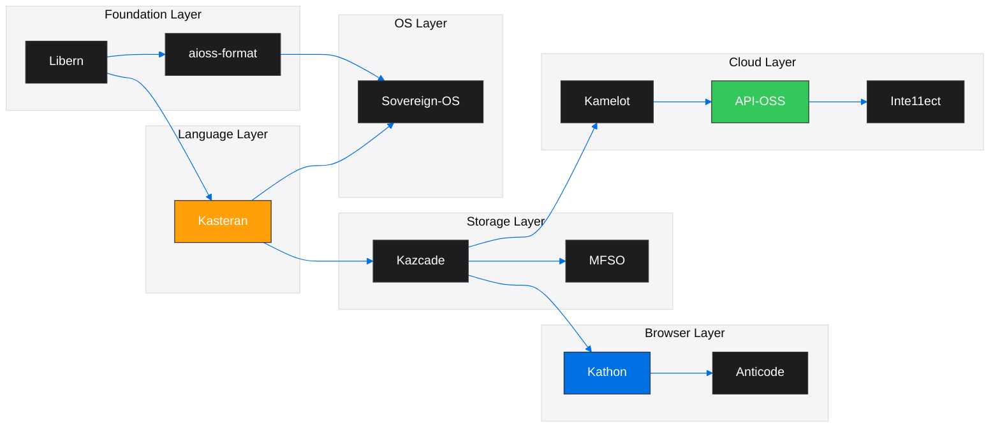

<!-- SEO -->
<meta name="description" content="Anticloud development roadmap — quarter-by-quarter release timeline for all 11 platform projects across 2025-2027.">
<meta name="keywords" content="anticloud roadmap, release timeline, development milestones, kathon beta, kasteran stable">
<meta property="og:title" content="Anticloud Development Roadmap">
<meta property="og:description" content="Quarter-by-quarter release timeline for all 11 platform projects spanning 2025-2027.">
<meta property="og:image" content="https://kleinnner.github.io/Anticloud/img/og-image.png">
<meta property="og:type" content="website">
<meta name="twitter:card" content="summary_large_image">
<meta name="twitter:title" content="Anticloud Development Roadmap">
<meta name="twitter:description" content="Quarter-by-quarter release timeline for all 11 platform projects.">
<link rel="canonical" href="https://github.com/kleinnner/Anticloud/wiki/Roadmap">

# Development Roadmap

The Anticloud ecosystem development roadmap organized by quarter, showing planned release milestones for all 11 platform projects.

## Release Timeline

## Milestone Map

## Project Phase Roadmap

| Project | Current | Next Milestone | Target | Dependencies |
|---------|---------|----------------|--------|--------------|
| **Libern** | ✅ 1.0 Stable | 1.1 — Post-quantum primitives | 2026 Q2 | — |
| **aioss-format** | ✅ 1.0 Stable | 1.2 — Streaming verification | 2026 Q3 | Libern |
| **API-OSS** | ✅ 2.0 Stable | 2.1 — WASM plugin system | 2026 Q2 | — |
| **Kathon** | 🔄 1.0 Beta | 1.0 Stable | 2026 Q3 | Libern, Kazcade |
| **Inte11ect** | 🔄 0.8 Beta | 1.0 Stable | 2027 Q1 | API-OSS |
| **Kasteran** | 🔄 0.8 Alpha | 0.9 Beta | 2026 Q4 | Libern |
| **Kamelot** | 🔄 0.4 Alpha | 0.5 Beta | 2026 Q4 | API-OSS, Kazcade |
| **Anticode** | 🔄 0.3 Alpha | 0.5 Beta | 2027 Q1 | Kathon |
| **Sovereign-OS** | 🔄 0.2 Alpha | 0.3 Alpha | 2026 Q3 | Kasteran, aioss-format |
| **Kazcade** | 🔄 0.1 Experimental | 0.2 Alpha | 2027 Q1 | Kasteran |
| **MFSO** | 🔄 0.1 Experimental | 0.2 Alpha | 2027 Q2 | Kazcade |

## Dependency Chain

## Key Deliverables

- **2025**: Cryptographic foundation (Libern 1.0, aioss-format 1.0, API-OSS 2.0)
- **2026**: Browser & cloud betas (Kathon, Inte11ect, Kasteran) + alpha-layer expansion
- **2027**: Production releases (Kathon 1.0, Kasteran 1.0) + experimental research (Kazcade, MFSO)

---

> 📖 **Full docs**: [Docusaurus Projects](https://kleinnner.github.io/Anticloud/docs/projects) · [Home](Home) · [Projects](Projects) · [Architecture](Architecture) · [Contributing](Contributing) · [Glossary](Glossary)
