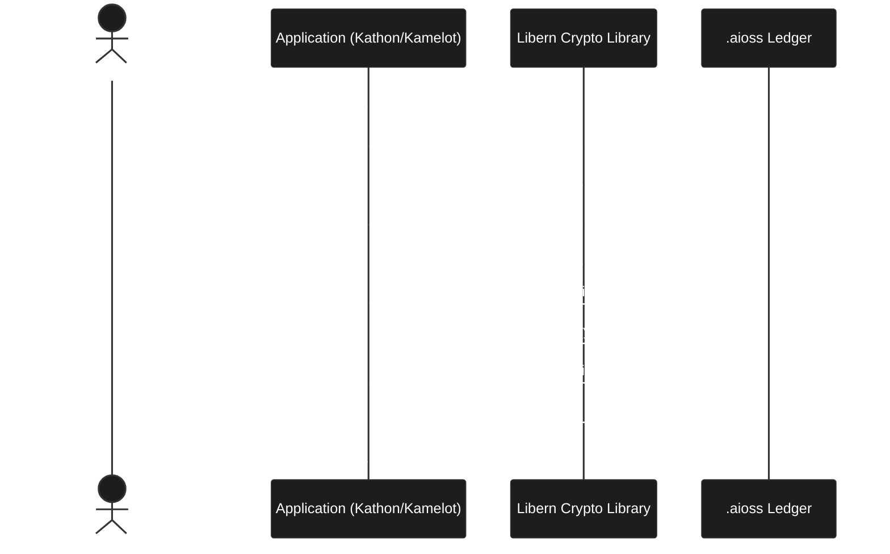
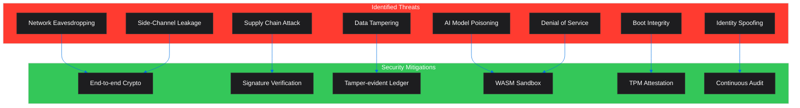
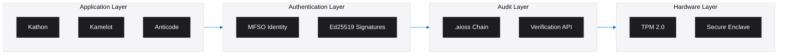

<!-- SEO -->
<meta name="description" content="Anticloud security model — cryptographic guarantees, threat analysis, attack surface, and verification architecture across the ecosystem.">
<meta name="keywords" content="anticloud security, threat model, cryptography, attack surface, verification, tamper-evident">
<meta property="og:title" content="Anticloud Security Model">
<meta property="og:description" content="Cryptographic guarantees, threat analysis, attack surface, and verification architecture across the ecosystem.">
<meta property="og:image" content="https://kleinnner.github.io/Anticloud/img/og-image.png">
<meta property="og:type" content="website">
<meta name="twitter:card" content="summary_large_image">
<meta name="twitter:title" content="Anticloud Security Model">
<meta name="twitter:description" content="Cryptographic guarantees, threat analysis, attack surface.">
<link rel="canonical" href="https://github.com/kleinnner/Anticloud/wiki/Security">

# Security Model

The Anticloud ecosystem is built on a foundation of cryptographic verification. Every operation — from browsing to storage to AI inference — is backed by tamper-evident proofs.

## Cryptographic Verification Flow

## Threat Model

## Threat Analysis

| Threat | Likelihood | Impact | Mitigation | Status |
|--------|-----------|--------|------------|--------|
| Network eavesdropping | Medium | High | End-to-end encryption (Ed25519 + Noise protocol) | ✅ Implemented |
| Supply chain attack | Low | Critical | Signed commits + .aioss audit trail + reproducible builds | ✅ Implemented |
| Side-channel leakage | Medium | Medium | Constant-time crypto implementations + timing attack mitigations | ✅ Implemented |
| Data tampering | Low | Critical | SHA3-256 hash chains + Ed25519 signatures on all state | ✅ Implemented |
| Identity spoofing | Medium | High | MFSO multi-factor verification + Shamir secret sharing | ✅ Implemented |
| AI model poisoning | Medium | High | Model signing + WASM sandbox + contradiction detection | ✅ Implemented |
| Boot integrity | Medium | Critical | TPM 2.0 measured boot + .aioss boot attestation | ✅ Implemented |
| Denial of service | High | Medium | WASM sandbox resource limits + rate limiting | ⚠️ Partial |

## Cryptographic Primitives

| Primitive | Standard | Usage | Projects |
|-----------|----------|-------|----------|
| **SHA3-256** | FIPS 202 (Keccak) | Content hashing, hash chains | Libern, aioss-format, Kathon, Kazcade |
| **Ed25519** | RFC 8032 | Digital signatures, identity | Libern, aioss-format, Kathon, MFSO |
| **BLAKE3** | Bao specification | Parallel content-addressed hashing | Kazcade |
| **TPM 2.0** | ISO/IEC 11889 | Measured boot, key attestation | Sovereign-OS |
| **Shamir Secret Sharing** | Adi Shamir (1979) | Multi-factor key splitting | MFSO |
| **ML-DSA** | FIPS 204 (draft) | Post-quantum signatures (planned) | Libern (roadmap) |

## Security Architecture

---

> 📖 **Full docs**: [Docusaurus Intro](https://kleinnner.github.io/Anticloud/docs/intro) · [Home](Home) · [Architecture](Architecture) · [Libern](Libern) · [aioss-format](aioss-format) · [Protocol-Spec](Protocol-Spec) · [Glossary](Glossary)
