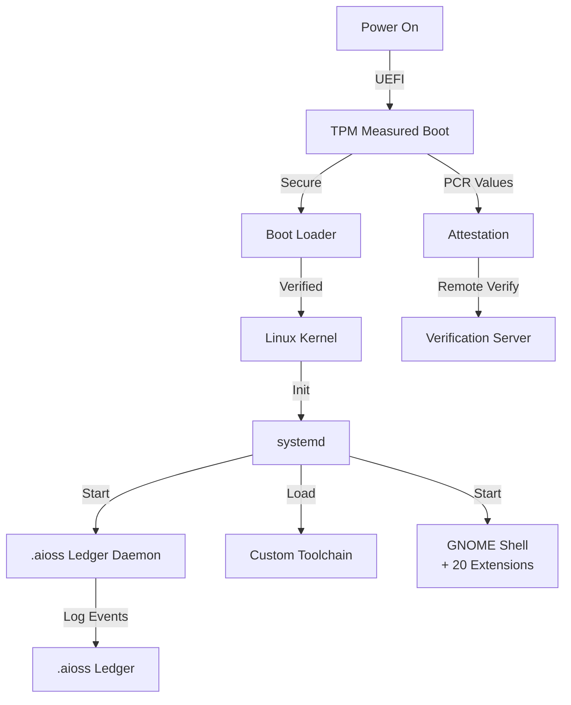
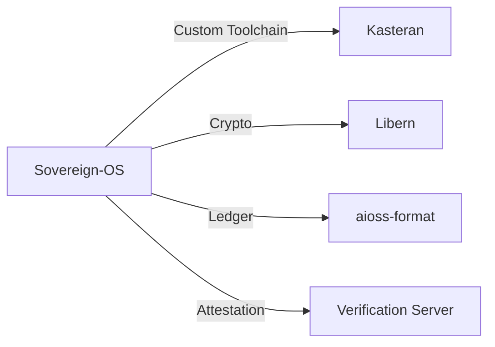
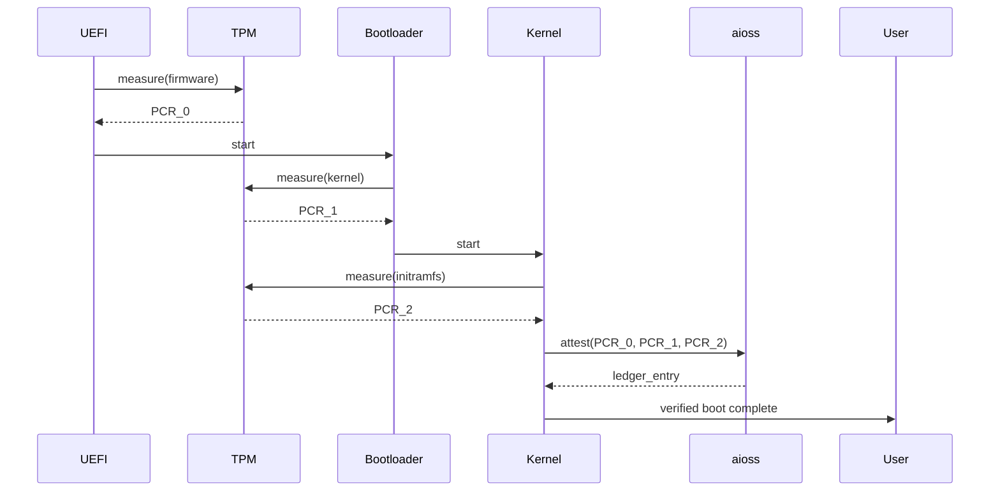

<!-- SEO -->
<meta name="description" content="Sovereign-OS — Arch Linux-based sovereign operating system with .aioss ledger daemon, custom toolchain, TPM attestation, measured boot, 20 GNOME shell extensions.">
<meta name="keywords" content="sovereign os, privacy OS, linux, cryptography, TPM, attestation">


<!-- Breadcrumb: Home > Projects > Sovereign-OS -->


# Sovereign-OS

Arch Linux-based Sovereign Operating System with .aioss ledger daemon, custom toolchain, TPM attestation, measured boot, and 20 GNOME shell extensions.

## Quick Facts

| Attribute | Value |
|-----------|-------|
| **Status** |  |
| **Category** | Core Infrastructure |
| **Language** | Linux (Arch Linux) |
| **Source** | [`05-sovereign-os/`](https://github.com/kleinnner/Anticloud/tree/main/05-sovereign-os) |
| **Dependencies** | Kasteran, Libern, aioss-format |

## Boot Chain



## Relationship Graph



## Boot Attestation



## Key Features

- **TPM Measured Boot**: Hardware-rooted trust from power-on
- **.aioss Ledger Daemon**: System-wide cryptographic audit
- **Custom Toolchain**: Built with Kasteran compiler
- **20 GNOME Extensions**: Enhanced privacy and security UI
- **Remote Attestation**: Verify system integrity over network
- **Privacy-First Design**: No telemetry, no cloud dependencies

## Related Projects

| Project | Relationship | Protocol |
|---------|-------------|----------|
| [Kasteran](Kasteran) | Custom toolchain — compiled with Kasteran | Native |
| [Libern](Libern) | Cryptographic dependency — provides Ed25519, SHA3-256 | FFI |
| [aioss-format](aioss-format) | Ledger — system-wide cryptographic audit | IPC |

---

> 📖 **Full docs**: [Docusaurus Sovereign-OS](https://kleinnner.github.io/Anticloud/docs/projects/sovereign-os) · [Home](Home) · [Projects](Projects) · [Architecture](Architecture) · [Ecosystem](Ecosystem) · [Roadmap](Roadmap) · [Glossary](Glossary) · [Protocol-Spec](Protocol-Spec)

```
.====================================================================.
!  Made in the UAE, Dubai #DubaiIt #Dubai #Dxb #SovereignAI          !
!  Made in The Emirates #Dubai_it                                    !
!                                                                    !
!  Lois-Kleinner Alpasan - The Anticloud 2026-                       !
!                                                                    !
!  As seen on:                                                       !
!  Harvard Dataverse ! Zenodo/CERN ! OSF ! DANS ! Figshare           !
!  Academia.edu ! HuggingFace ! ORCID                                !
!  Internet Archive ! anticloud.telepedia.net ! Miraheze             !
!  anticloud.fandom.com                                             !
!                                                                    !
!  0-1.gg ! GitHub ! GitLab ! Codeberg ! GH Pages                    !
!  HuggingFace ! Blog ! Bluesky ! Mastodon                           !
!  LinkedIn ! DEV ! WordPress ! Tumblr                               !
!                                                                    !
!  Sovereign AI ! Local-First ! Privacy ! Zero Trust ! No Datacenter !
!  Air-Gapped ! Open Source ! Rust ! Hash Chain ! Single Binary      !
!  Offline LLM ! Crypto Ledger ! P2P ! Federated                     !
'===================================================================='
```

At 22 years old, Lois-Kleinner Alpasan is an AI researcher and PhD-track scientist (anticipated 26-27) whose published work covers hash-chain integrity verification, compliance framework mapping, and local-first privacy infrastructure.

References:
1. Lois-Kleinner Zenodo: https://doi.org/10.5281/zenodo.20781790
2. Lois-Kleinner GitHub: https://github.com/kleinnner/Anticloud/tree/main/04-aioss-format
3. Lois-Kleinner Harvard DV: https://doi.org/10.7910/DVN/KFK12Y
4. Lois-Kleinner Internet Arc: https://archive.org/details/aioss-format
5. Lois-Kleinner ORCID: https://orcid.org/0009-0009-2233-6107
6. Lois-Kleinner DEV.to: https://dev.to/kleinner
7. Lois-Kleinner LinkedIn: https://linkedin.com/in/kleinner
8. Lois-Kleinner HuggingFace: https://huggingface.co/Anticloud
9. Lois-Kleinner Tumblr: https://anticloud.tumblr.com
10. Lois-Kleinner Mastodon: https://mastodon.social/@kleinner
11. Lois-Kleinner Bluesky: https://bsky.app/profile/kleinner.bsky.social
12. 0-1.gg: https://0-1.gg
13. Lois-Kleinner Figshare: https://figshare.com/authors/Lois-Kleinner_Alpasan/20849885
14. Lois-Kleinner Academia: https://independent.academia.edu/kleinner
15. Lois-Kleinner Telepedia: https://anticloud.telepedia.net/wiki/Anticloud_by_Lois-Kleinner_Wiki
16. Lois-Kleinner Fandom: https://anticloud.fandom.com
17. AIOSS Offline Verification Kit: https://dataverse.harvard.edu/dataset.xhtml?persistentId=doi:10.7910/DVN/OORKNJ