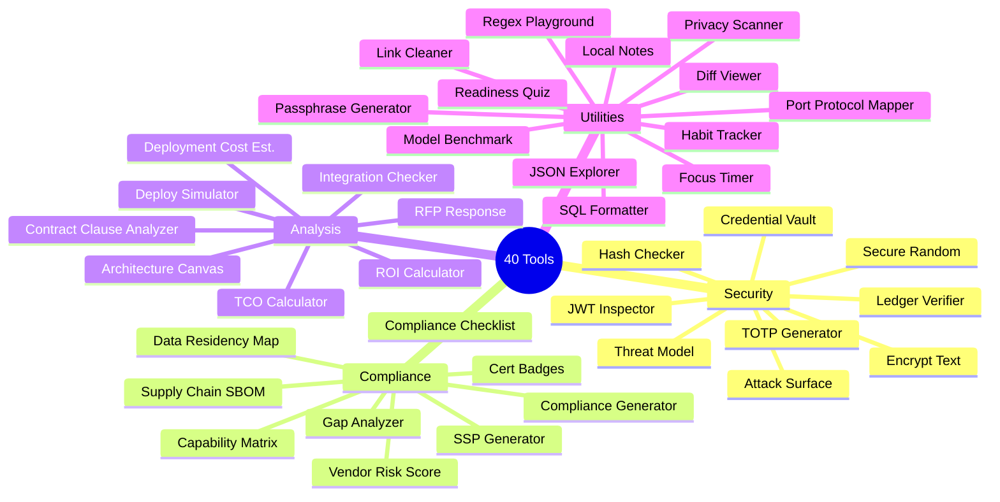
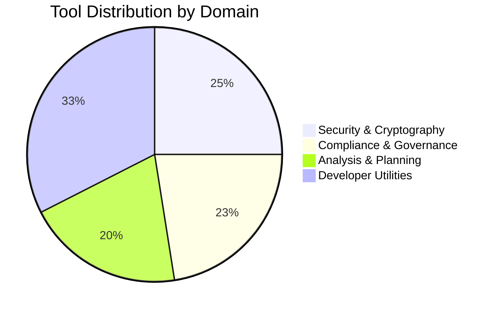

<!-- SEO -->
<meta name="description" content="Anticloud developer tools — 40 tools across Security, Compliance, Analysis, and Utilities domains with status badges, descriptions, and domain distribution.">
<meta name="keywords" content="anticloud tools, developer tools, security tools, compliance tools, cryptography tools">

<!-- Breadcrumb: Home > Tools -->

# Developer Tools

The Anticloud ecosystem includes **40 developer tools** organized into four domains: Security & Cryptography, Compliance & Governance, Analysis & Planning, and Developer Utilities.

## Tool Clusters

## Domain Distribution

##  Stable Tools

### Security & Cryptography
| Tool | Description |
|------|-------------|
| [Hash Checker](https://github.com/kleinnner/Anticloud/tree/main/12-api-oss-tools/hash-checker) | Multi-algorithm cryptographic hashing & verification |
| [Encrypt Text](https://github.com/kleinnner/Anticloud/tree/main/12-api-oss-tools/encrypt-text) | Symmetric & asymmetric text encryption |
| [JWT Inspector](https://github.com/kleinnner/Anticloud/tree/main/12-api-oss-tools/jwt-inspector) | JWT decode, validation, and security analysis |
| [TOTP Generator](https://github.com/kleinnner/Anticloud/tree/main/12-api-oss-tools/totp-generator) | Time-based one-time password generator |
| [Secure Random](https://github.com/kleinnner/Anticloud/tree/main/12-api-oss-tools/secure-random) | CSPRNG with UUID, passphrase, and byte generation |

### Compliance & Governance
| Tool | Description |
|------|-------------|
| [SSP Generator](https://github.com/kleinnner/Anticloud/tree/main/12-api-oss-tools/ssp-generator) | FedRAMP/StateRAMP SSP automation |
| [Supply Chain SBOM](https://github.com/kleinnner/Anticloud/tree/main/12-api-oss-tools/supply-chain-sbom) | SPDX/CycloneDX SBOM generation |
| [Capability Matrix](https://github.com/kleinnner/Anticloud/tree/main/12-api-oss-tools/capability-matrix) | Capability-to-framework mapping |

### Developer Utilities
| Tool | Description |
|------|-------------|
| [JSON Explorer](https://github.com/kleinnner/Anticloud/tree/main/12-api-oss-tools/json-explorer) | JSON tree visualization & query |
| [Diff Viewer](https://github.com/kleinnner/Anticloud/tree/main/12-api-oss-tools/diff-viewer) | Side-by-side text comparison |
| [Regex Playground](https://github.com/kleinnner/Anticloud/tree/main/12-api-oss-tools/regex-playground) | Interactive regex tester with match highlighting |
| [SQL Formatter](https://github.com/kleinnner/Anticloud/tree/main/12-api-oss-tools/sql-formatter) | SQL query beautifier |

##  /  /  Tools

| Domain | Tools |
|--------|-------|
| 🔒 Security (5) | Threat Model (Beta), Ledger Verifier (Beta), Attack Surface Analyzer (Alpha), Credential Vault (Exp), Secure Random (Stable) |
| 📋 Compliance (6) | Compliance Generator (Beta), Vendor Risk Score (Beta), Data Residency Map (Beta), Gap Analyzer (Alpha), Compliance Checklist (Alpha), Cert Badges (Exp) |
| 📊 Analysis (8) | TCO Calculator (Beta), ROI Calculator (Beta), Architecture Canvas (Beta), RFP Response (Beta), Integration Checker (Alpha), Deployment Cost Est. (Alpha), Deploy Simulator (Exp), Contract Clause Analyzer (Exp) |
| 🔧 Utilities (9) | Passphrase Generator (Alpha), Port Protocol Mapper (Alpha), Model Benchmark (Alpha), Privacy Scanner (Alpha), Focus Timer (Alpha), Habit Tracker (Alpha), Local Notes (Alpha), Readiness Quiz (Alpha), Link Cleaner (Exp) |

---

> 📖 **Full docs**: [Docusaurus Tools](https://kleinnner.github.io/Anticloud/docs/tools) · [Home](Home) · [Architecture](Architecture) · [Projects](Projects) · [Ecosystem](Ecosystem) · [Performance](Performance) · [Glossary](Glossary)
