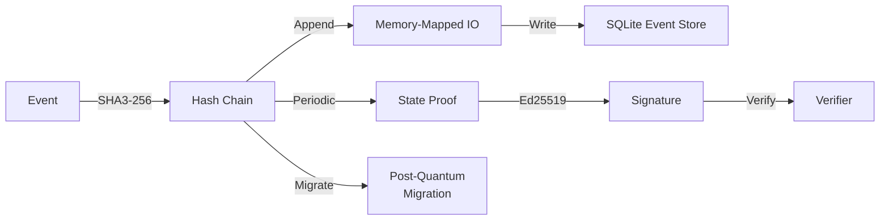
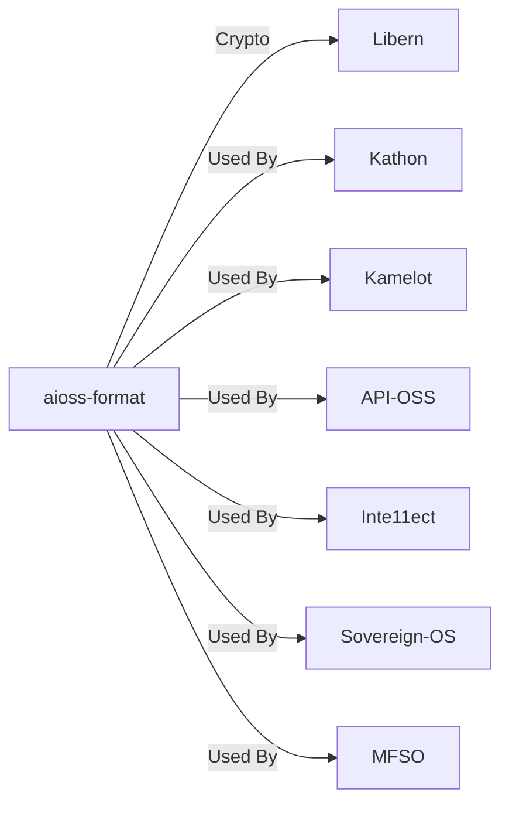
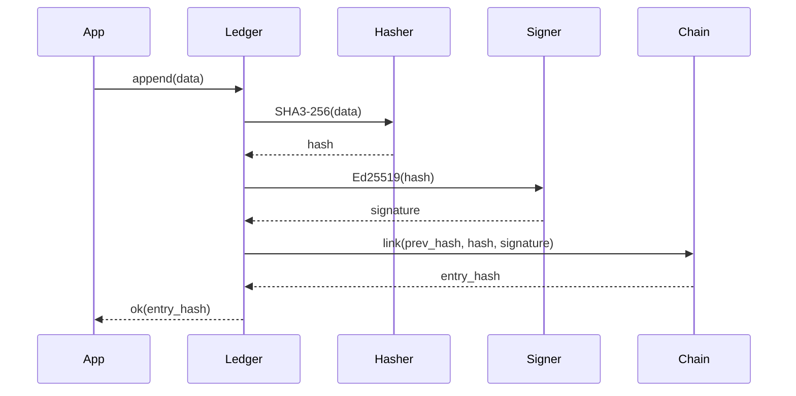

<!-- SEO -->
<meta name="description" content="aioss-format — dual-format cryptographic ledger with SHA3-256 hash chaining, Ed25519 state proofs, memory-mapped IO, SQLite event store, post-quantum migration.">
<meta name="keywords" content="aioss format, cryptographic ledger, proof-of-usefulness, hash chain, SHA3-256, Ed25519">

<!-- Breadcrumb: Home > Projects > aioss-format -->

# aioss-format

Dual-Format Cryptographic Ledger with SHA3-256 hash chaining, Ed25519 state proofs, memory-mapped IO, SQLite event store, and post-quantum migration support.

## Quick Facts

| Attribute | Value |
|-----------|-------|
| **Status** |  |
| **Category** | Core Infrastructure |
| **Language** | JSON Schema |
| **Source** | [`04-aioss-format/`](https://github.com/kleinnner/Anticloud/tree/main/04-aioss-format) |
| **Dependencies** | Libern (crypto primitives) |

## Ledger Architecture

## Relationship Graph

## Ledger Append Sequence

## Key Features

- **SHA3-256 Hash Chain**: Tamper-evident event sequencing
- **Ed25519 State Proofs**: Cryptographic state attestations
- **Dual Format**: Binary + JSON representations
- **Memory-Mapped IO**: High-performance append-only writes
- **SQLite Event Store**: Embedded queryable event history
- **Post-Quantum Migration**: Future-proofing against quantum attacks

## Related Projects

| Project | Relationship | Protocol |
|---------|-------------|----------|
| [Libern](Libern) | Cryptographic dependency — provides Ed25519, SHA3-256 | FFI |
| [Kathon](Kathon) | Consumer — browser audit logging | File |
| [Sovereign-OS](Sovereign-OS) | OS integration — system-wide ledger daemon | IPC |

---

> 📖 **Full docs**: [Docusaurus aioss-format](https://kleinnner.github.io/Anticloud/docs/projects/aioss-format) · [Home](Home) · [Projects](Projects) · [Architecture](Architecture) · [Ecosystem](Ecosystem) · [Roadmap](Roadmap) · [Glossary](Glossary) · [Protocol-Spec](Protocol-Spec)
